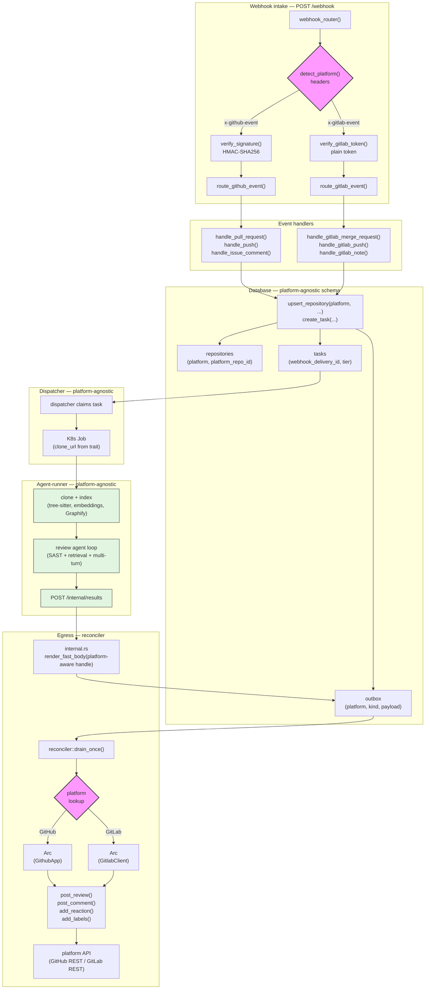

# ADR-0072: Platform-abstraction layer (`CodePlatform` trait) for GitHub + GitLab

- **Status:** Accepted
- **Date:** 2026-07-06
- **Deciders:** @leghadjeu-christian

## Context and Problem Statement

The control plane was built GitHub-first: a `GithubApp` struct owned App-JWT minting and every
GitHub REST call; the webhook handler at `POST /github/webhook` parsed GitHub payloads; the
outbox table was named `github_outbox` with a `github_id` column; the reconciler took a concrete
`GithubApp` and minted installation tokens per row; the DB schema carried `github_repo_id`,
`github_delivery_id`, `github_review_id`, `github_comment_id`. Adding GitLab support by
forking each of those paths would duplicate the egress queue, the reconciler loop, the webhook
router, and the schema — five coupling points, five parallel implementations, and a permanent
"which platform is this row?" bug surface.

How do we add GitLab alongside GitHub without doubling the control plane's egress path, the
reconciler, the webhook router, and the schema — and without touching the platform-agnostic
agent-runner at all?

## Decision Drivers

- **Nothing breaks.** GitHub must work byte-for-byte as before until an operator opts into GitLab.
- **One egress writer.** ADR-0059 already mandates a single reconciler owns all platform egress via
  a transactional outbox; a second platform must not introduce a second writer.
- **Agent-runner is platform-agnostic.** ADR-0017 already keeps all credentials in the control
  plane; the runner just clones a Git URL. The platform layer must not leak into the Job.
- **Least necessary professional change.** Refactor the coupling points into a trait, don't fork
  them.
- **Manual repo approval.** ADR-0063's approval gate already exists for GitHub; GitLab repos must
  pass the same gate (no auto-registration from webhooks).

## Considered Options

- **Option A — `CodePlatform` trait + two implementations, unified routes/tables.** One async trait
  abstracts webhook verification, delivery dedup, changed-files/SHAs fetch, review/comment/reaction
  posting, and clone-URL synthesis. `GithubApp` implements it (refactored from existing code);
  `GitlabClient` implements it (new). A single `/webhook` route detects the platform from headers.
  A single `outbox` table carries a `platform` column. The reconciler takes a
  `HashMap<Platform, Arc<dyn CodePlatform>>` and dispatches per row.
- **Option B — Fork everything.** A parallel `gitlab_outbox` table, a `POST /gitlab/webhook` route,
  a second reconciler loop, a `GitlabApp` struct with its own egress path. The DB keeps
  `github_*` columns and adds `gitlab_*` columns side by side.
- **Option C — Trait the runner, not the control plane.** Push platform awareness into the
  agent-runner so it can post directly to either platform. This contradicts ADR-0002 (control plane
  owns the trust boundary) and ADR-0022 (control plane owns the posted output) and would put
  platform credentials in the Job.

## Decision Outcome

Chosen option: **"Option A — `CodePlatform` trait + two implementations, unified routes/tables"**,
because it satisfies every driver: GitHub is a pure refactor (phases 0–3 change no behavior), the
agent-runner is untouched, the single-writer rule from ADR-0059 is preserved, and the schema gains
one `platform` column instead of a parallel set of `gitlab_*` columns.

### Consequences

- Good, because adding a third platform (e.g. Bitbucket, Gitea) is now "implement the trait + add
  to the HashMap" — no schema change, no new route, no new reconciler.
- Good, because the reconciler, outbox, and webhook router are platform-agnostic at the call site —
  the trait object carries the platform-specific behaviour.
- Good, because the DB schema is platform-agnostic: `platform` + `platform_repo_id` (composite
  unique) instead of `github_repo_id` (single-column unique).
- Neutral, because `post_comment` probes MR notes then issue notes (GitLab uses different endpoints
  per noteable type and the outbox only carries the `issue_number`). The probe costs one 404 on the
  wrong type; acceptable for a reply/failure-notice path that fires once per task.
- Neutral, because `platform_repo_id = 0` is used as a placeholder in the `RepoRef` built by the
  reconciler when draining the outbox — no trait method reads it (auth uses `installation_id`,
  URL paths use `owner/repo`). A future revision may store the real id in the outbox if a method
  comes to need it.

## Flow Diagram

The diagram below shows how a webhook enters the control plane, is dispatched by
platform, flows through the platform-agnostic task queue and agent-runner, and
returns to the platform-specific egress path via the outbox and reconciler.

**Key invariants:**

- `detect_platform()` is the only branch point at intake — everything downstream
  is trait-dispatched or platform-agnostic.
- The agent-runner (green) never sees the platform — it receives a `clone_url`
  and posts results to the internal API.
- The reconciler's `HashMap<Platform, Arc<dyn CodePlatform>>` is the only branch
  point at egress — one writer, one loop, one `outbox` table.

## Pros and Cons of the Options

### Option A — `CodePlatform` trait + unified routes/tables

- Good, because phases 0–3 are pure refactors with zero behavior change for GitHub (verified by
  `cargo test`: 87 passed, 0 failed across all phases). The one wire-format change — renaming
  `github_delivery_id` to `webhook_delivery_id` in the task API JSON — is a controlled breaking
  change: new frontends must use the `webhook_delivery_id` field name (ADR-0072).
- Good, because the agent-runner is entirely untouched — it already clones a Git URL and talks to
  the internal API; the control plane just hands it the right `clone_url` via the trait.
- Good, because one migration (`0024_platform_abstraction.sql`) renames `github_*` → `platform_*`
  and adds `platform TEXT NOT NULL DEFAULT 'github'` — existing rows are valid without a backfill.
- Bad, because the trait needs `async-trait` (a runtime dependency) and `dyn CodePlatform` (a vtable
  dispatch per outbox row). Both are negligible: `async-trait` is a 0-dep macro, and the outbox
  drains in batches of 50 with network calls dominating.

### Option B — Fork everything

- Good, because each platform's code path is fully independent — no trait, no dispatch, no shared
  schema.
- Bad, because it doubles the egress writer (violates ADR-0059), doubles the reconciler loop,
  doubles the webhook router, and adds a parallel `gitlab_*` column family to the schema.
- Bad, because a third platform would require a third fork — linear growth in coupling points.

### Option C — Trait the runner

- Good, because the runner could post directly to the platform, skipping the outbox hop for
  non-GitHub platforms.
- Bad, because it violates ADR-0002 (trust boundary) and ADR-0022 (control plane owns posted
  output) — platform credentials would live in the Job, and the runner could post unreviewed
  content.
- Bad, because the runner is platform-agnostic today and that's a property worth keeping.

## Known Limitations

### GitLab Clone URL URL Encoding
**Status:** Low-risk limitation, documented in `services/control-plane/src/integrations/gitlab.rs`

- `clone_url()` builds `https://oauth2:{token}@{host}/{repo}.git` without URL-encoding the token or
  repo path. GitLab PATs are alphanumeric + hyphens, and project paths are typically alphanumeric +
  hyphens + underscores, so malformed URLs are extremely unlikely.
- **Impact:** None in practice; malformed URLs would cause `git clone` to fail, which would be caught
  and retried by the agent-runner.
- **Mitigation:** URL-encoding would break the OAuth2 format (`:` in token would be misinterpreted as
  scheme separator). A proper fix would require git credential helpers or `.netrc`, out of scope for
  the current implementation.

### Agent Runner @-Passthrough Edge Case
**Status:** Rare edge case, documented in `services/agent-runner/src/bootstrap/client.rs`

- `authenticated_clone_url()` uses `rest.contains('@')` to detect a pre-authenticated URL. This is
  correct for GitLab's `oauth2:TOKEN@host` format, but if a GitLab subgroup path contains `@` (e.g.
  `group@team/repo.git`), the function would wrongly pass it through without splicing the token.
- **Impact:** Extremely rare; neither GitHub nor GitLab allow `@` in usernames, org names, or
  subgroup paths.
- **Mitigation:** The guard is sufficient for all currently supported platforms; the edge case is
  documented for future review if a platform with different naming rules is added.

## More Information

- Implementation plan: [`docs/gitlab-implementation-plan.md`](../gitlab-implementation-plan.md)
- Integration report (GitHub coupling points + GitLab API mapping):
  [`docs/gitlab-integration-report.md`](../gitlab-integration-report.md)
- Related ADRs:
  - [ADR-0002](0002-rust-control-plane-trust-boundary.md) — control plane owns the trust boundary
  - [ADR-0017](0017-agent-runner-control-plane-bootstrap.md) — runner bootstraps from the control
    plane (no credentials in the Job)
  - [ADR-0022](0022-review-writeback-control-plane.md) — control plane validates + posts the review
  - [ADR-0059](0059-reconciler-owns-all-github-egress.md) — reconciler owns all egress via the
    outbox (now platform-agnostic)
  - [ADR-0063](0063-cli-only-repository-approval.md) — CLI-only repo approval (same gate for GitLab)
- The trait lives at `services/control-plane/src/integrations/platform.rs`; the GitLab
  implementation at `services/control-plane/src/integrations/gitlab.rs`; the GitHub implementation
  in `services/control-plane/src/integrations/github.rs` (`impl CodePlatform for GithubApp`).