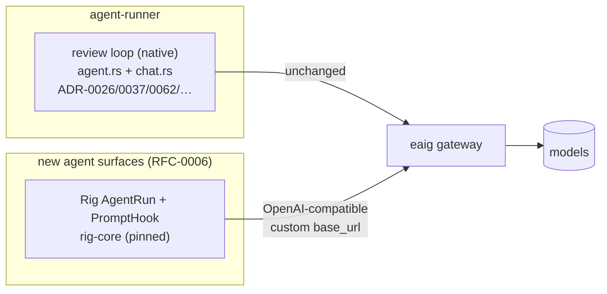

# ADR-0075: Rig for new agent surfaces; the native review loop stays native

- **Status:** Proposed
- **Date:** 2026-07-09
- **Deciders:** @stephane-segning

## Context and Problem Statement

[ADR-0026](0026-native-review-agent.md) replaced OpenCode with a native Rust agent loop, and that
loop has since accreted a lot of deliberate, review-specific machinery: mediated write tools
([ADR-0037](0037-agent-acts-via-mediated-tools.md)), per-tier tool allowlists
([ADR-0062](0062-two-tier-review-fast-auto-deep-on-demand.md)), context-window budgeting
([ADR-0045](0045-context-window-budget.md) / [ADR-0070](0070-window-proportional-prompt-budgets.md)),
the coverage gate ([ADR-0041](0041-full-diff-coverage-gate.md) /
[ADR-0069](0069-review-tier-minimum-model-capability.md)), the refute pass
([ADR-0043](0043-review-finding-verification.md)), and a transport
([`chat.rs`](../../services/agent-runner/src/review/native/chat.rs)) hardened against real
provider quirks — Gemini-3 `thought_signature` round-trip via `extra_content`,
`reasoning_content` capture ([ADR-0060](0060-capture-model-reasoning-and-glm-5-2-latency-finding.md)),
gateway-specific usage fields, SSE stall detection, Retry-After honoring
([ADR-0039](0039-agent-llm-resilience-and-observability.md)).

[RFC-0006](../rfc/0006-a2a-agent-surface.md) (A2A support) will add **new agent kinds** that are
not the review loop — conversational/general agents behind an A2A surface. The question: do we
hand-roll a second loop and transport for those (extending ADR-0026's approach), or adopt an LLM
framework — and if a framework, does it also replace the review loop?

[Rig](https://github.com/0xPlaygrounds/rig) (rig-core, MIT, 0.39.0 as of 2026-06-19) has matured
into a plausible fit: custom base-URL OpenAI-compatible provider (our eaig gateway,
[ADR-0018](0018-openai-compatible-embeddings.md) posture), explicit message-history control,
per-response usage including cached/reasoning token detail, and — decisive for our mediated-tool
model — a sans-IO `AgentRun` state machine (0.39) plus `PromptHook` interception, so the tool
loop is steppable rather than a black-box `.prompt()`. The cost is a deliberately unstable API:
twelve breaking 0.x minors in the last six months, with more announced.

## Decision

**Adopt Rig for new agent surfaces only, gated on a transport-fidelity spike. The review agent —
loop and transport — stays native and untouched.** ADR-0026 is *scoped*, not superseded: its
"own the loop" rationale remains binding for the review path, where the loop *is* the product.

Terms of adoption:

- **Spike gate (before the dependency lands):** point Rig's OpenAI provider at eaig and run a
  multi-turn tool-calling conversation against a Gemini-3-class model **through the gateway**,
  asserting: (a) tool-call `extra_content` / `thought_signature` survives the round trip
  verbatim, (b) `reasoning_content` (and its `reasoning` alias) is capturable, (c) usage fields
  we bill from are exposed per response, (d) request-side passthrough (reasoning-budget extras)
  is possible. Rig fixed signature round-trip in its *native* Gemini provider; **we talk
  OpenAI-compatible to a gateway**, so the OpenAI provider's typed deserialization is exactly
  where nonstandard fields get dropped — the failure family of the Gemini
  `thought_signature` incident ([#262](https://github.com/vymalo/lightbridge-code-intelligence/pull/262),
  ADR-0060 territory). A failed spike kills this ADR (status → Rejected with findings), and new
  surfaces extend the native transport instead.
- **Exact version pin** of `rig-core` in the workspace `Cargo.toml`; upgrades are batched on our
  cadence (not the upstream fortnightly one) and get a changelog review, since upstream declares
  every minor potentially breaking.
- **Dependency hygiene:** Rig's reqwest/rustls lineage must be checked against the workspace's
  two-crypto-provider situation (`ring` installed explicitly at
  [`main.rs:501`](../../services/control-plane/src/main.rs) to prevent the rustls
  ambiguous-provider panic, [#264](https://github.com/vymalo/lightbridge-code-intelligence/issues/264));
  a third provider or conflicting reqwest major is a spike-stage rejection criterion.
- **Not adopted:** `rig-vertexai` (open `thoughtSignature` drop,
  [rig#2026](https://github.com/0xPlaygrounds/rig/issues/2026)) — irrelevant anyway while all
  model access rides eaig; `rig-postgres` for our embedding/retrieval path — the existing split
  (runner holds the embeddings key, control plane holds the vectors and serves scoped search,
  [ADR-0020](0020-mcp-servers-via-control-plane.md)) is a security property Rig's all-in-one
  vector-store model would blur. Retrieval stays as is.
- **Boundary rule for future work:** any proposal to migrate the *review* loop or transport to
  Rig is a new ADR that must supersede ADR-0026 explicitly and demonstrate parity for the
  ADR-0037/0041/0043/0045/0060/0062/0069/0070 behaviors — not an incremental drift.

## Consequences

- **Good:** new agent kinds start from a maintained loop/provider layer instead of a second
  hand-rolled one; RFC-0006's conversational agents get streaming, tool dispatch, and usage
  accounting on day one, with `PromptHook`/`AgentRun` giving the same mediation points the
  review loop proved we need (every tool call interceptable; history fully owned).
- **Good:** zero risk to the dogfood-hardened review path — the two stacks share only the
  gateway. A Rig regression can never break a PR review.
- **Bad:** a churn-heavy dependency (breaking minor ~every 2 weeks upstream; two more breaking
  refactors — Tool-trait flattening, hooks v2 — already announced). Accepted because the pin +
  batch-upgrade policy converts churn into scheduled maintenance, and the alternative is
  hand-rolling a general-purpose loop we would maintain forever.
- **Bad:** two agent stacks in the runner codebase (native + Rig) is a real cognitive cost, and
  the boundary invites "why not port the review loop" pressure. The boundary rule above makes
  that a deliberate, ADR-gated decision instead of drift.
- **Neutral:** the review transport keeps its bespoke resilience behaviors (SSE idle timeout,
  Retry-After, rate-limit header parsing, circuit breaker); new surfaces get Rig's equivalents
  and inherit our retry posture via hook-level wrapping where Rig's are thinner. Parity is not
  required — the surfaces have different stakes.

## Alternatives considered

- **Extend the native loop/transport into a general-purpose framework.** Maximal control and one
  stack, but `agent.rs` (≈3,900 lines) is review-shaped through and through; generalizing it is
  a rewrite wearing a refactor costume, and we would own every future provider/loop feature.
  Rejected: ADR-0026's "own the loop" was about the *review* product, not a doctrine that all
  loops must be ours.
- **Rig everywhere (replace `chat.rs` + `agent.rs`).** Even if the spike passes, the net
  deletion is smaller than it looks — the budgets/gates/mediation logic is ours regardless, and
  we would re-verify eight ADRs of behavior for zero user-visible gain, while inheriting the
  churn treadmill on the critical path. Rejected now; re-openable via the boundary rule.
- **A different framework** (llm-chain, langchain-rust, genai, async-openai + hand loop).
  Surveyed 2026-07: none combine a steppable loop, hook-based mediation, active maintenance,
  and OpenAI-compatible custom-gateway support at Rig's level; async-openai would cover
  transport only (loop still hand-rolled). Rejected.
- **Defer until RFC-0006 lands.** Tempting, but the framework choice shapes RFC-0006's
  reference design (tool mediation, streaming, usage accounting), so deciding scope + running
  the spike now de-risks that RFC. The spike is half a day; deferral saves nothing.

## References

- [RFC-0006](../rfc/0006-a2a-agent-surface.md) — the new agent surfaces this decision equips;
  [RFC-0005](../rfc/0005-durable-orchestration-on-restate.md) — the durable-task substrate those
  surfaces run on.
- [ADR-0026](0026-native-review-agent.md) — scoped (not superseded) by this decision: binding
  for the review path.
- [ADR-0037](0037-agent-acts-via-mediated-tools.md), [ADR-0060](0060-capture-model-reasoning-and-glm-5-2-latency-finding.md),
  [ADR-0039](0039-agent-llm-resilience-and-observability.md) — the behaviors that define the
  spike's fidelity bar.
- Upstream: [rig-core on crates.io](https://crates.io/crates/rig-core) ·
  [0xPlaygrounds/rig](https://github.com/0xPlaygrounds/rig) ·
  [rig#2026 (vertexai thoughtSignature drop)](https://github.com/0xPlaygrounds/rig/issues/2026).
