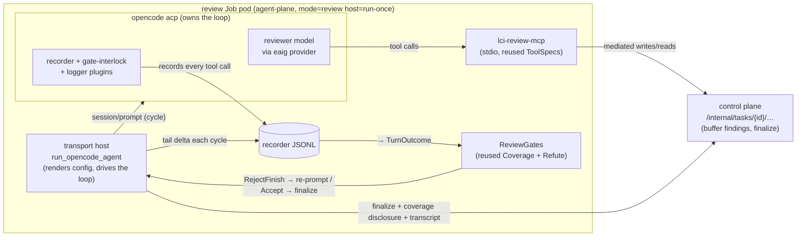

# ADR-0097: Review runs on OpenCode (RFC-0009 Phase 3 cutover)

- **Status:** Accepted (owner-directed 2026-07-16) — host built + proven against real OpenCode; the
  live dispatch cutover (slice 5) is gated on a shadow parity run
- **Date:** 2026-07-16
- **Deciders:** @stephane-segning

## Context and Problem Statement

[RFC-0009](../rfc/0009-opencode-acp-agent-host.md) adopts OpenCode-over-ACP as the agent-loop host to
stop maintaining our own loop (the #411-class streaming/reasoning bugs), and [ADR-0094](0094-opencode-acp-open-mode-host.md)
shipped it for `open` mode. The RFC **deliberately deferred** the `review`-mode cutover to "its own
ADR" (Phase 3), gated on a review **eval harness** (the open [#252](https://github.com/vymalo/lightbridge-code-intelligence/issues/252)
item) proving OpenCode-hosted review matches the native loop.

**On 2026-07-16 the owner reversed that sequencing.** The eval harness does not exist and the native
loop keeps generating maintenance load; rather than block the cutover on building a harness first, the
directive was: cut the live review path to OpenCode now, and gate it on a **shadow parity run** (run
both engines on the same PRs, diff the findings) — a lighter, sufficient bar than a full eval harness.

This ADR records the architecture that decision produced, and the fact that it is a **reversal of
RFC-0009's Phase-2/3 phasing**, not a fulfilment of it. It does **not** yet supersede
[ADR-0026](0026-native-review-agent.md) (the native review agent): the native loop remains the live
review host until slice 5 (the dispatch cutover) lands and the shadow shows parity.

## Decision Drivers

- **Offload the loop, keep the review quality.** The reused tuned gates (coverage/refute) and tools
  are what protect review quality; the migration must reuse them verbatim, not reimplement them.
- **Coverage accounting must stay exact.** The native coverage gate only works if it sees every file
  read; anything that lets the model read off the mediated path breaks it.
- **No dormant flag; hard cutover.** Per repo doctrine (ADR-0086 precedent) the live path is swapped in
  one move, gated on evidence — here the shadow, not a feature flag.
- **Prove wire-boundary behaviour by running it.** OpenCode is an external process over a protocol;
  "compiles + unit tests pass" is not proof (the #246 lesson).

## Decision

Review runs on OpenCode as a **thin transport host over a reused Rust core**. OpenCode owns its agent
loop; the supervisor observes and re-drives. The tuned review gates stay in Rust and run supervisor-side.

### The loop-ownership split

One `session/prompt` runs OpenCode's *entire* internal agent cycle (many model turns, many tool
calls) and returns once. So the native review policies split into two classes:

| policy class | native owner | OpenCode owner |
|---|---|---|
| context-trim, wind-down, read/turn budgets (ADR-0042 batching) | `AgentLoop`, per turn | **OpenCode's own maintained loop** (the supervisor can't narrow tools mid-cycle) |
| **coverage gate, refute gate** (ADR-0041/0091 — the review-quality gates) | `AgentLoop`, at finish | **supervisor**, reusing the exact `TurnPolicy` code |

### Load-bearing decisions (all verified against OpenCode 1.18.3)

1. **Reuse the Rust gates supervisor-side — do NOT reimplement them in TypeScript.** `ReviewGates`
   composes the same `CoverageGate` + `RefuteGate` the native flow does; each OpenCode cycle is
   reconstructed as a `TurnOutcome` and fed through the identical `after_turn_actions`. On a
   `RejectFinish` the supervisor re-prompts OpenCode; on accept it finalises. The gate-interlock
   plugin ([ADR-0095](0095-opencode-plugins-recording-and-gates.md)) is an in-process backstop only.
2. **The gate input is the recorder JSONL, not ACP `session/update`.** The recorder plugin runs
   in-process and is the completeness authority — it sees subagent-internal tool calls an ACP client
   is never shown, so an `explore` subagent's `read_file`s still count toward coverage.
3. **Built-in tools are disabled at the config TOP LEVEL, not per-agent.** OpenCode-over-ACP runs its
   default `build` agent, not a custom `review` agent, so a per-agent `tools` block is ignored — a
   real model would then be offered built-in `read`/`grep`/`glob` and could investigate off the
   mediated path, escaping coverage accounting. A top-level `tools` disable is agent-independent;
   verified via the e2e's advertised-tools assertion (per-agent left `read`/`grep`/`bash`/… advertised;
   top-level leaves only the four `lightbridge_*` tools).
4. **`session/new.mcpServers` is a JSON array; stdio MCP is wired via the config `mcp` block.** The
   mediated review tools (`lci-review-mcp`, reusing the tuned `ToolSpec`s) are stdio MCP declared in
   the rendered config, not via `session/new` (which honours only http/sse there).
5. **The cutover gate is a shadow parity run, not the #252 eval harness.** `cargo xtask shadow diff`
   compares the two engines' findings on the same PR; **only-native** (an issue native caught that
   OpenCode missed) is the regression that blocks the cutover. Procedure:
   [`integrations/opencode/sim/SHADOW.md`](../../integrations/opencode/sim/SHADOW.md).
6. **Config isolation (security): opencode runs with a NEUTRAL cwd + empty HOME/XDG — never the
   checkout.** opencode merges config from its cwd's `opencode.json` and from HOME/XDG over
   `OPENCODE_CONFIG`. The checkout is **untrusted** (a PR from a fork could ship an `opencode.json`),
   and `opencode debug config` confirmed such a file **fully overrides ours** — re-enabling built-in
   `read`/`bash`, flipping `permission` to `allow`, injecting an MCP server that runs commands, and
   swapping the model. So the host spawns opencode with cwd = a throwaway workdir (holding only our
   `OPENCODE_CONFIG`, named `opencode.review.json` so it isn't itself auto-loaded as a project config)
   and empty HOME/XDG. File reads still reach the checkout through `lci-review-mcp` (`LCI_MCP_CHECKOUT`),
   so opencode never needs it as cwd. `OPENCODE_CONFIG_DIR` does **not** solve this — it locates our
   config but doesn't stop the cwd project-config merge.

### Data flow

The host returns the same `ReviewOutcome` (Finished / Exhausted / Aborted) the native host does, so
`finalize_review_outcome` — and the whole control-plane finalize/shaping/egress path — is untouched at
the cutover.

### Build slices

| slice | what | state |
|---|---|---|
| 1 | `lci-review-mcp` — reuse the tuned review tools over stdio MCP | merged (#440) |
| 2–3 | the review core (recorder→`TurnOutcome` adapter, `ReviewGates`, `ReviewDriver`, config renderer, transcript, drive loop) + the transport host, proven against real OpenCode | merged (#442–#447) |
| — | bot-review fixes + the top-level-tools coverage-parity fix | merged (#448, #449) |
| 4 | shadow parity gate (`xtask shadow diff` + runbook) | merged (#450) |
| 5 | **dispatch cutover** — thread CP/embed creds into `perform_review`, swap `run_native_agent → run_opencode_agent`, build the combined image, wire ai-helm-values, hard-cut | merged (#452), live 2026-07-17 |
| 6 | restore the ADR-0066 external-knowledge (customer) MCP surface in `lci-review-mcp` (slice 1 stubbed it with `std::iter::empty()`) | this ADR's follow-up |

### External / customer MCP servers go through the mediated ADR-0066 path — NOT OpenCode config

A customer adds their own MCP to the reviewer by declaring it in the **control-plane** config
([`McpServerConfig`](../../services/control-plane/src/config.rs), owner-managed in ai-helm-values).
The control plane connects to it, discovers its tools, and re-exposes them to the agent as mediated
`mcp__<server>__<tool>` tools via `GET/POST /internal/tasks/{id}/knowledge/{tools,call}` (ADR-0066),
size-capped and framed as untrusted. The runner **never** talks to the customer's server directly.

This is the same mediation seam as `read_file`/retrieval, and it is deliberately **not** "let the
customer add an entry to OpenCode's `mcp` block." Injecting customer MCP servers into the rendered
OpenCode config would (a) run the customer's transport/credentials *inside our review Job pod* next to
the eaig key, internal CA, and git token, and (b) reopen exactly the config surface decision #6 closes
(the neutral-cwd/empty-HOME lockdown). The mediated path keeps the customer's server outside our pod,
keeps the tool calls in the recorder/coverage/attribution accounting, and needs zero per-customer
runner code. Slice 1 of this cutover shipped `lci-review-mcp` with that discovery iterator stubbed to
`std::iter::empty()` ("wired in a later slice"); slice 6 restores it, so customer MCPs are reachable on
the OpenCode review path with parity to the native loop.

## Consequences

### Positive

- The agent loop (streaming, tool-call orchestration, context budgeting) is OpenCode's to maintain.
- Review quality is preserved by construction: the same tuned gates, the same tools, the same prompt.
- The finalize/egress path is unchanged, so the cutover's blast radius is the review *loop* only.

### Negative / risks

- **Fine sampling params (top_p, max_tokens) don't all map 1:1** once OpenCode owns the loop — a known
  fidelity gap; temperature is passed best-effort.
- **A future OpenCode version could add a built-in tool** not in the disabled set, silently re-opening
  the coverage hole — the e2e's advertised-tools assertion is the guard, and every version bump re-runs
  the RFC-0009 probe.
- **The shadow is a lighter bar than a real eval harness (#252).** It catches missed findings on the
  sampled PRs, not systematic quality drift; #252 remains the durable quality instrument.

## Alternatives considered

- **Reimplement coverage/refute in TypeScript plugins** — rejected: duplicates tuned logic (#306/#304/
  #407/ADR-0091) into a second source of truth that drifts; violates reuse-what-the-workspace-provides.
- **Block the cutover on the #252 eval harness first (RFC-0009's Phase 2)** — reversed by the owner:
  the harness doesn't exist and the maintenance cost is now; the shadow is the sufficient interim gate.
- **Gate the live path behind a `REVIEW_ENGINE` flag** — rejected per hard-cutover doctrine; the switch
  is a one-move swap in `perform_review`, gated on shadow evidence.

## Relationship to other records

- **Amends [RFC-0009](../rfc/0009-opencode-acp-agent-host.md)** — realises its intent for `review` but
  reverses its Phase-2/3 phasing (shadow-gated, ahead of the eval harness).
- **Builds on** [ADR-0094](0094-opencode-acp-open-mode-host.md) (the ACP host), [ADR-0095](0095-opencode-plugins-recording-and-gates.md)
  (recorder + gate-interlock plugins), [ADR-0096](0096-mediated-forge-read-tools.md) (mediated reads).
- **Does not yet supersede** [ADR-0026](0026-native-review-agent.md) — the native loop is the live
  review host until slice 5 cuts over. On that cut, ADR-0026 becomes historical.
