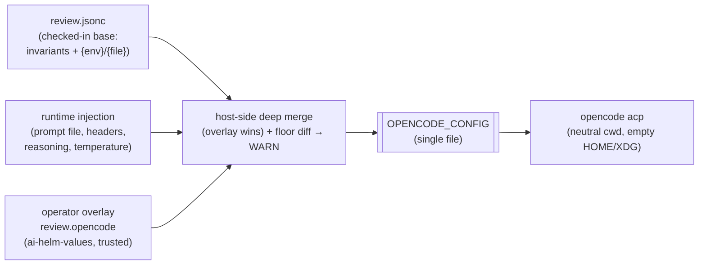

# ADR-0098: Operator-supplied OpenCode config overlay for review (file-based base + full override)

- **Status:** Accepted (owner-directed 2026-07-17)
- **Date:** 2026-07-17
- **Deciders:** @stephane-segning

## Context and Problem Statement

Review runs on OpenCode ([ADR-0097](0097-review-runs-on-opencode.md)). Today the review OpenCode
config is generated inside Rust as a `serde_json::json!` blob in
[`render_review_config`](../../services/review-agent/src/opencode/config.rs). Two problems follow:

1. **It's opaque to operators.** A SysAdmin cannot read what the reviewer actually runs — the model,
   the agents, the permissions, the disabled tools — without reading Rust. There is no supported way
   for them to extend it: add a custom sub-agent, point a tier at a different model, or grant a
   sub-agent a different access model.
2. **It diverges from `open` mode**, which is already a readable, checked-in `.jsonc`
   ([`integrations/opencode/config/opencode.jsonc`](../../integrations/opencode/config/opencode.jsonc))
   rendered per task via `{env:*}`/`{file:*}` substitution. Review is the only mode still hand-built
   in code.

The owner's directive: **let a SysAdmin pass their own OpenCode config, merged with ours, and make
the base config OpenCode-native (a file), documenting exactly what we inject and override internally
so the operator is aware.**

### Why this is not a reversal of ADR-0097 #6

ADR-0097 #6 locked down config injection **from the untrusted checkout** (a fork PR shipping an
`opencode.json` that re-enables `bash`, injects a command-running MCP, or swaps the model). That
lockdown stays: opencode still runs with a neutral cwd and empty HOME/XDG, so the checkout can inject
nothing. This ADR adds a **trusted** config surface — an overlay that arrives only through the
operator config channel (ai-helm-values), authored by a SysAdmin who already controls the model,
prompt, and tool allowlist. Trusted operator config ≠ untrusted checkout; the two are different
boundaries and both hold at once.

## Decision Drivers

- **Operator extensibility without a code change.** Custom sub-agents, extra models/providers, extra
  MCP servers, per-agent access models — all owner-configurable in ai-helm-values.
- **Config as a readable artifact.** The base is a checked-in OpenCode config a SysAdmin can read,
  not a Rust blob; "what the reviewer runs by default" is inspectable.
- **Awareness over prevention (owner's choice).** The operator is trusted and gets **full override**;
  the system's job is to make what it injects/overrides *visible and documented*, and to *warn* when
  an override breaks a review invariant — not to forbid it.

## Decision

### 1. The base config moves to an OpenCode-native file

Replace the Rust `json!` renderer with a checked-in `integrations/opencode/config/review.jsonc`
(mirroring `open` mode), rendered per task. The file is the human-readable source of truth for the
review agent surface. Dynamic values ride placeholders and a small, documented runtime-injection
layer (below), so the file stays static and honest.

### 2. Three layers, last-writer-wins, merged host-side

The final `OPENCODE_CONFIG` handed to opencode is built in this order:

| # | layer | source | contents |
|---|---|---|---|
| 1 | **base** | `review.jsonc` (checked in) | the invariants + defaults: disabled built-ins (top-level `tools`), read-only `permission`, the `lightbridge` MCP, the recorder/gate/logger plugins, the `eaig/reviewer` model wiring via `{env:*}` |
| 2 | **runtime injection** | the supervisor, per task | the per-task system prompt (written to a file, referenced `{file:*}`); attribution/billing headers (#89, dynamic keys); the tier's `reasoning` flag (deep on / fast off, ADR-0069); `temperature` when set; the `lci-review-mcp` env |
| 3 | **operator overlay** | `review.opencode` in ai-helm-values (trusted) | anything the SysAdmin wants: extra `agent.*` sub-agents, extra `provider.*`/models, extra `mcp.*`, `permission`/`tools` changes |

The merge is a **deep merge with the overlay winning on every key (full override)** — the owner's
chosen policy. Objects merge recursively; scalars and arrays from the overlay replace ours. The merge
happens **in Rust** (not via opencode's own HOME/XDG/project merge, which stays disabled for
checkout-injection safety) so the untrusted checkout is never a config source — only layers 1–3 are.

### 3. What the runtime injects/overrides internally (the SysAdmin-facing contract)

`review.jsonc` carries a documented header, and this table is mirrored there, so an operator sees what
the runtime sets on top of the file **before** their overlay — and therefore what their overlay is
overriding:

| key | who sets it | can the overlay change it? |
|---|---|---|
| `model`, `provider.eaig.*` | base `{env:*}` from the ai-models chart | yes (point a tier elsewhere) |
| `agent.review.prompt` | runtime `{file:*}` (per-task, dynamic) | yes, but it will be replaced each task unless the overlay sets a different agent |
| `provider.eaig.options.headers` | runtime (attribution #89) | yes |
| `models.reviewer.reasoning` | runtime (tier: deep=true/fast=false) | yes |
| `tools.{read,grep,glob,bash,…}=false` | base (coverage invariant, ADR-0097 #3) | **yes — but see the floor warning** |
| `permission.{edit,bash,webfetch}=deny` | base (read-only invariant) | **yes — but see the floor warning** |
| `mcp.lightbridge`, `plugin[*]` | base (finalize/coverage path) | yes — overriding these can break `finish`/coverage |

### 4. Full override, with a coverage/read-only floor *warning* (not a lock)

Because the overlay wins on every key, it can weaken the review's guarantees — re-enable built-in
`read`/`bash` (coverage goes blind), flip `permission` to `allow` (review can mutate/egress), or add a
sub-agent with a broader access model. That is **permitted by design** (the operator is trusted and
asked for it). The system makes it *visible*, not impossible:

- at render time the supervisor diffs the merged config against the base floor and **logs a WARNING**
  naming each invariant the overlay relaxed (built-in re-enabled, permission opened, `lightbridge`
  MCP/plugin dropped/replaced);
- when the floor is breached, the review's coverage disclosure notes that a custom operator config
  was active, so a finding set produced under relaxed coverage isn't mistaken for the default.

### 5. Constraints the overlay must respect (documented for the SysAdmin)

- **OpenCode's schema rejects unknown keys** (verified 1.18.2: even a `"//"` string-key fails with
  *"Unrecognized key"*). A typo'd or non-schema key in the overlay fails the **entire** config and the
  review won't start — the overlay must be valid OpenCode config.
- **Secrets ride `{env:*}` placeholders**, never inlined — same as the base.
- **The checkout is still not a config source.** HOME/XDG stay empty and cwd stays neutral
  (ADR-0097 #6); the overlay is the *only* external config input, and it is trusted.

### Data flow

## Consequences

### Positive

- A SysAdmin configures custom sub-agents, models, providers, and access models with zero code change,
  all in ai-helm-values.
- The review agent surface becomes a readable file, consistent with `open` mode.
- What the runtime injects/overrides is documented in-file and here, so full override is exercised
  with full visibility.

### Negative / risks

- **Full override can silently degrade review quality/safety** if an operator relaxes the coverage or
  read-only floor. Mitigated by the render-time WARNING + coverage disclosure, not prevented — this is
  the accepted cost of the owner's full-override choice.
- **A malformed overlay fails the whole review** (opencode's strict schema). The failure is loud
  (review won't start) rather than silent, but it is an operational footgun; the docs call it out.
- **Sub-agents with broader access interact with coverage accounting.** A sub-agent that reads via a
  built-in tool reads off the mediated path; coverage is measured from the recorder, so such reads may
  not count the way `lightbridge_read_file` does. Documented as a known interaction of custom access
  models.

## Alternatives considered

- **Protected floor / additive-only overlay** — rejected by the owner in favour of full override: it
  couldn't express "a sub-agent with a different access model," which is a stated goal.
- **Let opencode do the merge via HOME/XDG/project config** — rejected: that is exactly the checkout
  injection surface ADR-0097 #6 closes. The merge must be host-side so the checkout is never a source.
- **Keep the Rust `json!` renderer and add a merge on top of it** — rejected: leaves the base opaque;
  the owner's point is to make the config OpenCode-native and readable, not to bolt a merge onto a blob.

## Relationship to other records

- **Builds on** [ADR-0097](0097-review-runs-on-opencode.md) (review on OpenCode) and reaffirms its
  decision #6 (checkout config isolation) as an orthogonal, still-active boundary.
- **Complements** the mediated external-MCP path (ADR-0066): that path is the *safe default* for adding
  customer tools (mediated, no pod access); this overlay is the *power tool* for trusted operators who
  need deeper control (agents, models, access models).
