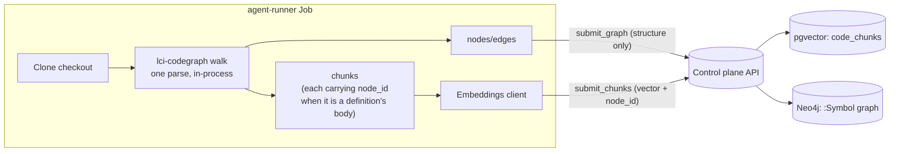

# Indexing and storage

How Lightbridge turns a checkout into the two retrieval surfaces a review reads: a **structural
graph** in Neo4j and a **semantic chunk store** in pgvector. The pipeline runs inside the
agent-runner Job; the control plane owns both datastores (the runner has no direct DB access and
submits everything over the internal API).

> **Dual retrieval, two stores.** Neo4j answers "what relates to what" (symbols, containment, calls);
> pgvector answers "what reads like this" (cosine-nearest chunks). They are complementary, not
> interchangeable — see [ADR-0003](adr/0003-dual-retrieval-neo4j-pgvector.md).

> **In-house structural graph ([ADR-0086](adr/0086-in-house-code-graph-crate.md)) — the Python
> Graphify CLI has been retired.** The structural graph is now built **in-process** by the Rust crate
> `lci-codegraph`: it owns chunking, a configurable **ignore-list** (gitignore-style globs that compose
> with the repo's `.gitignore`), bounded **PDF text extraction**, and a structurally-resolved
> call/reference **graph with cross-file resolution for Rust** — all over one tree-sitter parse, no
> Python, no subprocess. It emits the **same** `GraphNodePayload`/`GraphEdgePayload` shape Graphify's
> `graph.json` parse used to, so the two datastores, the internal-API boundary, and the retrieval tools
> described here are unchanged. There is **no flag and no fallback** — `lci-codegraph` is the sole graph
> engine. Retiring Graphify removed the Python runtime and collapsed the ~4 Gi index-Job / #207 image
> split, so the `index` and `review` images are now one lean runtime; indexing becomes the `index`
> **mode** of the `agent-plane` ([ADR-0085](adr/0085-agent-execution-plane.md)). Languages without a
> graph extractor yet get no structural facts, but the windowed-text fallback keeps them semantically
> searchable.

## Who builds what



**One walk produces both indexes** ([ADR-0117](adr/0117-one-walk-node-id-symbol-embeddings.md)). The
in-house `lci-codegraph` crate parses each file once and emits, from that single parse, the semantic
chunks *and* the structural nodes/edges — and records on each chunk the `node_id` of the definition it
is the body of, when it is one. The crate lives at
[ADORSYS-GIS/lci-codegraph](https://github.com/ADORSYS-GIS/lci-codegraph) and is consumed as a pinned
git dependency (see `services/agent-runner/Cargo.toml`); it replaced the Python Graphify CLI
(ADR-0086), with no flag and no fallback.

Two submissions follow, in this order:

- **Structural** — nodes + `contains`/`method`/`calls` edges, **carrying no vectors**. Code:
  `services/agent-runner/src/indexer/graph.rs`,
  `services/control-plane/src/integrations/neo4j.rs`.
- **Semantic** — each chunk is embedded once and submitted with its `node_id`. The control plane
  upserts the `code_chunks` row (pgvector) and, when a `node_id` is present, attaches that same vector
  to the matching `:Symbol`. Code: `services/agent-runner/src/indexer/mod.rs`,
  `services/agent-clients/src/embeddings.rs`.

The order matters: the symbol attach uses `MATCH`, never `MERGE`, so a vector whose symbol is not in
the graph is dropped rather than creating a node with an embedding and no structural facts.

The structural pass is **best-effort** — a graph failure (or an unconfigured graph store returning
503) is logged, not fatal. The task still succeeds with a populated pgvector index; the symbols that
never landed simply carry no vector. The symbol attach is best-effort for the same reason, and runs
*after* the pgvector write, so a graph outage cannot reject a batch that already reached the store
retrieval depends on.

## When indexing runs (and when it is skipped)

```rust
// services/agent-runner/src/main.rs
let needs_index = context.command == "index" || !context.repo_indexed;
```

- A standalone **`index`** task (target_type `repository`) — enqueued on admin approval and on every
  default-branch push.
- A review on a **cold** repo (no base index yet) — indexes first, then reviews.
- A review on an **already-indexed** repo — **reuses the base index** ([ADR-0025](adr/0025-review-reuses-base-index.md)).
  It searches related code via the retrieval tools and already carries the PR diff in its prompt, so
  the costly full re-index is skipped. (Skipping it is why a review no longer takes as long as an
  index every time.)

### Re-index on default-branch push

The base index is kept fresh on the default branch. `handle_push`
(`services/control-plane/src/http/webhook.rs`) ignores branch/tag deletions and any ref that is not
`refs/heads/<default_branch>`, applies the approval gate, then calls `create_index_task`. Each push
enqueues a fresh `index` task; `create_index_task` (`services/control-plane/src/db.rs`) skips when one
is already in flight so a burst of pushes doesn't pile up duplicates.

> `index` tasks share an idempotency tuple `(repo, 'repository', repo, 'index', NULL head_sha,
> run_epoch)` under a `NULLS NOT DISTINCT` unique index, so `run_epoch` is computed as
> `COALESCE(MAX(run_epoch), -1) + 1` over those columns. Hardcoding `run_epoch = 0` was a real bug —
> the *second* index for a repo collided with the first and was silently dropped.

## Semantic index (pgvector)

### Chunking — `lci-codegraph`

Syntax-aware first, windowed fallback second ([ADR-0010](adr/0010-graphify-treesitter-indexing-baseline.md)),
now owned by the crate rather than by a second chunker in this repo
([ADR-0117](adr/0117-one-walk-node-id-symbol-embeddings.md)).

- Languages with a grammar get tree-sitter chunks of named items — functions, methods, classes,
  `impl` blocks, structs, enums, traits, modules — and the recursion descends into container bodies so
  methods are independently indexed. The crate's language registry is the source of truth for which
  languages those are; it is considerably wider than the four this repo's own chunker used to handle,
  and it matches the set the graph pass understands, by construction.
- Tree-sitter is **error-tolerant**: a file is not dumped into the windowed fallback just because one
  expression fails to parse.
- Everything else — text/markdown/config files, and grammar-less languages — gets fixed overlapping
  line windows, `chunk_type` `window`.
- Guards (binary sniffing, a maximum file size, ignored directories) live in the crate, which honours
  the repo's own `.gitignore` composed with an operator-configurable glob layer — not a hardcoded
  directory list.

Each `Chunk` carries `file_path` (forward-slashed, OS-independent), `language`, `chunk_type`,
optional `symbol_name`, `start_line`/`end_line`, the raw `content`, and — the load-bearing addition —
`node_id`: the graph node this chunk is the body of, recorded during the same parse that emitted that
node. It is `None` for a windowed slice, a text file, or any chunk the graph pass produced no node
for; it is never a guess, since the crate only sets an id it has verified exists in that file's own
graph facts.

### Embeddings — `embeddings.rs`

An OpenAI-compatible client ([ADR-0018](adr/0018-openai-compatible-embeddings.md)) posting to
`POST {base}/v1/embeddings`. In production the base URL is the **eaig / core-gateway** (an Envoy AI
Gateway), the same endpoint LibreChat's RAG uses.

- **Model and dimension are operator-configured.** Live today: `qwen3-embedding-8b` at **4096 dims**
  (migration 0005), *not* the `text-embedding-3-small`/1536 the original ADR-0018 named — treat the
  model as deployment config, not a constant.
- **Batching** — `EMBED_BATCH_SIZE` = 32 chunks per round-trip, conservatively under the gateway's
  token-per-minute budget. Response order is not guaranteed, so vectors are re-sorted by the returned
  `index` field; a mismatched count is a hard error.
- **Reactive resilience** ([ADR-0039](adr/0039-agent-llm-resilience-and-observability.md)): retry only
  on transient failures (connect/timeout, HTTP 429, HTTP 5xx) — up to 3 times with exponential backoff
  capped at 8 s, honouring a 429's `Retry-After` over the computed backoff. A non-429 4xx (bad request,
  auth, unknown model) is deterministic and fails immediately with the body surfaced.
- **Rate-limit awareness** — reads the gateway's budget off response headers and soft-warns when low
  or limited (advisory; the budget is shared across runners).
- **TLS** — the gateway's internal HTTPS endpoint is signed by a private `ClusterIssuer/self-signed-ca`
  the default rustls roots don't trust. If `EMBEDDINGS_CA_CERT` is set, that CA PEM is *added to* the
  default roots; the Job mounts the CA and points the env at it.
- **Attribution** — per-request headers (epic #89) let the gateway bill the right project.

### Storage — `code_chunks` (`services/control-plane/src/db.rs`)

One row per chunk, keyed by snapshot. Schema (migration `0004_code_chunks.sql`, widened by
`0005_embedding_4096.sql`):

```sql
CREATE TABLE code_chunks (
    id            BIGSERIAL PRIMARY KEY,
    repository_id BIGINT  NOT NULL REFERENCES repositories (id) ON DELETE CASCADE,
    commit_sha    TEXT    NOT NULL,
    file_path     TEXT    NOT NULL,
    language      TEXT    NOT NULL,
    chunk_type    TEXT    NOT NULL,
    symbol_name   TEXT,
    start_line    INT     NOT NULL,
    end_line      INT     NOT NULL,
    content       TEXT    NOT NULL,
    embedding     vector(4096) NOT NULL,
    created_at    TIMESTAMPTZ  NOT NULL DEFAULT now(),
    UNIQUE (repository_id, commit_sha, file_path, start_line, end_line)
);
```

`upsert_code_chunks` writes a batch in one transaction; the embedding is rendered as a pgvector text
literal `[f0,f1,…]` (`vector_literal`) and cast server-side with `$N::vector` (no extra crate). The
`UNIQUE` key makes re-submitting a snapshot idempotent (`ON CONFLICT … DO UPDATE`).

#### No ANN index — exact cosine over a small scope

4096 dims exceeds pgvector's HNSW limit (2000 for `vector`, 4000 for `halfvec`), so migration 0005
**drops the HNSW index** and search is an **exact cosine scan**. That is fast because every query is
scoped to a single `(repository_id, commit_sha)` snapshot via `code_chunks_commit_idx`, a small
subset. `search_code_chunks` returns the `limit` nearest chunks by `embedding <=> $::vector`, scored
`1 - cosine_distance` in `[0,1]`. The scope is set by the control plane (the caller never picks it —
trust boundary).

#### Dimension guard

The pgvector column is fixed-width, so changing the embedding model's dimension is destructive.
`reconcile_embedding_dimension` runs at control-plane startup, reads the live width from
`pg_attribute.atttypmod`, and:

- no-ops if it already matches (or the column doesn't exist yet);
- if it differs and `embeddings.allow_reindex_on_dim_change` is **true**, atomically `TRUNCATE
  code_chunks` + `ALTER COLUMN embedding TYPE vector(N)` in one transaction (reindex from scratch);
- if the flag is **false**, **fails loud** — a config typo can't silently wipe the semantic index.

## Structural index (Neo4j)

### Extraction — `graph.rs` + the `lci-codegraph` crate

> The same walk also produces the semantic chunks — see [Who builds what](#who-builds-what). This
> section covers the structural half of its output.

The structural graph is built **in-process** by the `lci-codegraph` crate (ADR-0086), which walks the
checkout over one tree-sitter parse — no subprocess, no Python, no `graph.json` on disk. The runner's
`indexer/graph.rs` is a thin host: it calls `lci_codegraph::walk_checkout_from_env(&checkout, /* build_graph */ true)`
on a blocking thread and maps the crate's `Graph` onto the internal-API `GraphNodePayload`/`GraphEdgePayload`.

The crate emits symbol nodes (functions, methods, types, modules) with 1-based start lines and a `()`
suffix on callables, plus `contains` / `method` / `calls` edges, with **cross-file symbol resolution**
(a reference in file A resolved to a definition in file B) for Rust, Python, TypeScript/JavaScript
(including TSX/JSX), Java, Scala, Dart, Swift and CrateStack — Java additionally resolves through
Spring's annotation surface. Languages without a graph extractor yet (JSON, Jinja2 and Postgres are
parsed but classify no definitions) contribute no structural facts, and stay covered by the semantic
chunks from the same walk. An operator-configurable, gitignore-style **ignore-list**
(`LCI_CODEGRAPH_IGNORE_GLOBS`, composed with the repo `.gitignore`) and the crate's own
`LCI_CODEGRAPH_MAX_CHUNK_LINES` / `_WINDOW_SIZE` / `_WINDOW_STEP` knobs govern the walk — chunk shape
is the crate's to tune. `INDEX_EMBED_BATCH_SIZE` stays this repo's, and governs only how many chunks
are embedded per round trip.

A symbol's `:Symbol.embedding` does **not** arrive on this payload. It rides the chunk that is the
symbol's body, keyed by `node_id` ([ADR-0117](adr/0117-one-walk-node-id-symbol-embeddings.md)) — which
is why the structural submit runs first and carries structure only.

### Storage — `:Symbol` graph (`services/control-plane/src/integrations/neo4j.rs`)

`upsert_graph` writes per-row `MERGE` in a transaction, scoped by `(repo_id, commit)`:

```cypher
MERGE (s:Symbol {repo_id: $repo, commit: $commit, node_id: $id})
  SET s.label = $label, s.source_file = $file, s.start_line = $line;

MATCH (a:Symbol {repo_id: $repo, commit: $commit, node_id: $src})
MATCH (b:Symbol {repo_id: $repo, commit: $commit, node_id: $dst})
MERGE (a)-[r:REL {relation: $rel}]->(b);
```

Nodes are a generic `:Symbol`; edges a generic `[:REL {relation}]` — Cypher can't parameterize
labels/relationship types, so the kind lives in a property (batched `UNWIND` is a future optimization).
Retrieval mirrors the pgvector scoping: `search_symbols` does a substring match on label/`node_id`
within one snapshot; `callers_of` traverses `-[:REL {relation: 'calls'}]->` in reverse. Both pin to
`(repo_id, commit)` so a task only ever sees its own repo (trust boundary).

## Snapshot model, reuse, and pruning

A snapshot is a `(repository_id, commit_sha)` pair — one in pgvector (`code_chunks` rows), one in
Neo4j (`:Symbol` nodes for that `commit`). Every default-branch push writes a **full new snapshot** in
both stores.

### Retrieval pins to the latest snapshot

Reviews never index the PR head. `latest_indexed_commit`
([ADR-0050](adr/0050-retrieval-pins-to-latest-indexed-snapshot.md)) returns the most recently indexed
`commit_sha` for a repo (`ORDER BY created_at DESC, id DESC LIMIT 1`, backed by
`code_chunks_repo_recent_idx`, migration 0018). Both the index-skip decision and the retrieval scope
reference that same commit, so searches always run against a snapshot that **provably has chunks**.
Pinning to the PR head instead (the old behaviour) made every new head look "not indexed" (full
re-index per PR) *or*, with a naive "any rows?" check, returned zero hits at the head — a hollow index
that starved the agent.

### Pruning the rest

Nothing reaps old snapshots, so a busy repo would accumulate a full duplicate index per push in both
stores. The **index sweeper** (`services/control-plane/src/queue/index_sweeper.rs`, run periodically
by the dispatcher) keeps only the in-use snapshots and prunes the rest
([ADR-0052](adr/0052-index-snapshot-pruning.md)).

- Only repos holding more than one distinct `commit_sha` are considered (`repos_with_stale_snapshots`),
  so a steady-state repo costs one grouped count.
- **Keep-set** = the latest indexed commit ∪ every commit a non-terminal task pins (`in_use_commits`:
  any non-terminal task carrying a `head_sha`, e.g. an in-flight review).
- A repo is **skipped entirely while an `index` task is in flight** (`has_active_index_task`): the
  index task is the only thing *writing* a new snapshot, it carries a NULL `head_sha` (so
  `in_use_commits` can't protect the commit it's mid-writing), and the Neo4j graph has no recency
  grace. Deferring the prune one cycle is harmless.
- `prune_code_chunks` deletes rows whose `commit_sha ∉ keep`, **except** rows indexed in the last
  10 minutes (a recency grace, belt-and-suspenders over `in_use_commits`), and **no-ops on an empty
  keep-set** (never wipe a repo's whole index here). `neo4j::prune_graph` is the Neo4j half (delete
  `:Symbol` where `commit ∉ keep`, via `DETACH DELETE`).

Related lifecycle: a disabled/denied repo's index is fully purged (`delete_code_chunks_for_repo` plus
the graph delete); the purge reconciler re-runs against `list_disabled_repos_needing_purge` so a
cleanup lost to a restart still completes.

## Future direction — incremental / layered indexing

Today every default-branch push rebuilds the **whole** snapshot, and a PR reuses the base index with
no PR-specific overlay. [RFC-0002](rfc/0002-incremental-layered-indexing.md) proposes incremental,
layered indexing: a stable default-branch baseline plus a PR overlay keyed by `(base_sha, head_sha)`
that re-parses only changed files, updates graph edges only for affected symbols, and expires after
merge/close. The snapshot pruning above ([ADR-0052](adr/0052-index-snapshot-pruning.md)) is the first
piece of that RFC to land; the overlay model is not built yet.
