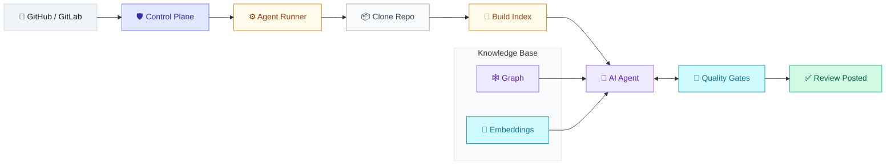

# Lightbridge Code Intelligence Overview

**Lightbridge Code Intelligence** is an AI-powered code review system that provides deep, repository-aware analysis of pull requests. It combines structural understanding (knowledge graphs) with semantic intelligence (vector embeddings) to deliver comprehensive, hallucination-free code reviews that integrate seamlessly into your development workflow.

## What it does

- **Reviews pull requests automatically** — On every PR opened, it posts a fast, deterministic review; on a maintainer `@mention`, it runs a deep, repo-aware review.
- **Answers questions** — A maintainer can `@mention` the system on an issue for conversational, repo-grounded answers.
- **Indexes repositories** — Once approved, Lightbridge clones the default branch and builds dual indexes (structural graph + semantic embeddings) that all reviews draw on.

## How it works

### The workflow

1. **Trigger** — A GitHub or GitLab event (PR opened, `@mention`, or push to default branch) triggers the system.

2. **Control Plane** — Validates the webhook, selects the review tier (fast or deep), and enqueues a task.

3. **Agent Runner** — Launches an isolated Kubernetes Job that:
   - Clones the repository
   - Builds or reuses the dual index (structural graph + semantic embeddings)
   - Runs the AI agent with quality gates

4. **AI Agent Loop** — The agent explores the codebase using:
   - **Tree-sitter** for parsing code into syntax trees
   - **Knowledge Graph** for structural relationships (what calls this?)
   - **Vector Embeddings** for semantic search (what implements similar behavior?)

5. **Quality Gates** — Three deterministic gates ensure accuracy:
   - **Coverage Gate** — Ensures every changed file is reviewed
   - **Refute Pass** — Requires AI to challenge its own assumptions
   - **Diff Alignment** — Validates comments anchor to actual changes

6. **Review Posted** — Validated findings are posted to the PR via the single egress point.

## Core technologies

### Syntax Trees
An **Abstract Syntax Tree (AST)** is a hierarchical representation of code structure. Unlike flat text, an AST captures how functions, classes, and statements are nested, allowing the system to understand code meaning rather than just appearance.

### Tree-sitter
**Tree-sitter** is a parser generator that works with partial, malformed code. It produces concrete syntax trees that can be updated incrementally, making it ideal for real-time code understanding.

### Knowledge Graph
A **Knowledge Graph** is a graph database (Neo4j) where every function, class, and module is a node, connected by edges representing dependencies and relationships. This enables the system to answer questions like "What functions call this modified function?"

### Vector Embeddings
**Vector Embeddings** are numerical representations of code that capture semantic meaning. By converting code snippets into high-dimensional vectors, the system can perform semantic similarity searches to find code implementing similar functionality.

## Two-tier review strategy

Running the full heavyweight loop on every PR is too slow and costly for most signals, so Lightbridge uses a two-tier strategy:

| | **Fast Tier** | **Deep Tier** |
|---|---|---|
| **Trigger** | automatic, on `pull_request opened` | manual, on any `@mention` |
| **Backbone** | **SAST** (deterministic) + lean diff-only LLM pass | full graph + vector retrieval, multi-turn |
| **Retrieval** | none (no retrieval tools) | full |
| **Tools** | small allowlist (`add_review_comment`, `finish`, `abort`) | full surface |
| **Target** | ≲ 2 min | async; long ceiling (2h acceptable) |

The fast tier turns SAST findings plus the raw diff into a human-readable verdict; the deep tier delivers the full repo-aware review.

## Quality gates

### Coverage Gate
The system enforces that the AI cannot simply skim a large PR and ignore complex files. A plugin intercepts the "finish review" tool and validates that every changed file has been read or commented on.

### Refute Pass
To prevent hallucinations, the system requires the AI to challenge its own assumptions. When proposing a high-severity finding, the AI shifts to a hardened skeptic persona and must search the knowledge base for evidence that its finding is wrong.

### Diff Alignment
The system validates that comments anchor to lines that actually changed. If the AI hallucinates line numbers, the finding is either realigned or downgraded to a general summary comment.

## Security and governance

- **Trust boundary** — The Control Plane owns all credentials and forge access; the AI Agent is entirely isolated.
- **Isolation** — Each task runs in an ephemeral Kubernetes Job with no persistence.
- **Single egress** — Only the Reconciler component talks to GitHub/GitLab; the AI Agent cannot make web requests.
- **AI governance** — Lightbridge adopts the ADORSYS-GIS AI Governance framework, ensuring AI output is reviewed as untrusted and humans own intent, verification, and consequences.

## Design principles

- **GitHub App, not a PAT-backed bot** — Uses official GitHub App for secure, scoped access.
- **Rust control plane owns trust boundaries** — All credentials and write actions are controlled by the control plane.
- **Graph + vector retrieval are complementary** — Structural graph for "what calls this?", vector embeddings for "what implements similar behavior?".
- **Agent execution is isolated per task** — Each review runs in its own isolated environment.
- **All write actions are controller-validated** — The control plane validates every finding before posting.
- **Security posture depends on trust level of source branch / fork** — Different trust levels apply to forks vs. direct contributions.

## Getting started

For detailed setup instructions, see [Local setup guide](local-setup.md).

For a deeper dive into the architecture, see:
- [Architecture overview](architecture.md)
- [Components and data models](components-and-data-models.md)
- [Jobs and lifecycle](jobs-and-lifecycle.md)
- [Review pipeline](review-pipeline.md)

For the full documentation index, see [INDEX.md](INDEX.md).