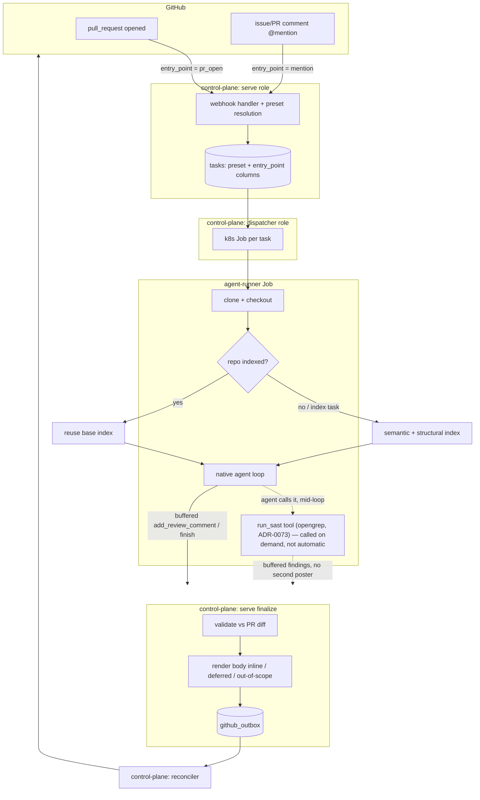

# Review pipeline (native agent, presets, SAST, verification)

This document describes the whole review subsystem end to end: from a GitHub event, through
preset resolution, the native agent loop (which may call the opengrep SAST tool), control-plane shaping of
the posted output, and finally egress to GitHub. It is the companion to
[github-app-and-control-plane.md](github-app-and-control-plane.md) (the App + trust boundary) and
[indexing-and-storage.md](indexing-and-storage.md) (the retrieval substrate a retrieval-heavy preset,
e.g. the default `deep`, reads from).

> **Note (updated 2026-07-18):** the **live** review path is **OpenCode-over-ACP**
> ([ADR-0097](adr/0097-review-runs-on-opencode.md), live in prod since 2026-07-17): the review loop is
> hosted on OpenCode, reusing the same coverage/refute gates and mediated tools supervisor-side. The
> **native in-process loop described below is now the fallback/legacy path** — its coverage/refute gate
> mechanics still run supervisor-side on the OpenCode path, so the sections below remain the reference
> for those gates and the mediated-tool contract, but the in-process loop is no longer the live host.

The review agent is a **native, in-process Rust loop** ([ADR-0026](adr/0026-native-review-agent.md))
acting via **mediated write tools** through the control plane
([ADR-0037](adr/0037-agent-acts-via-mediated-tools.md)). There is no OpenCode/ACP/MCP subprocess and
no fallback model: a single model is wrapped in retry/backoff/circuit-breaker resilience
([ADR-0039](adr/0039-agent-llm-resilience-and-observability.md),
[ADR-0053](adr/0053-remove-review-fallback-model.md)).

## End-to-end shape



A task carries a resolved `preset` column (`fast` | `deep` | any operator-defined name) plus an
`entry_point` column (`pr_open` | `mention` | `a2a`, migration `0033_task_preset`); the runner picks its
`ReviewConfig` by `preset`, and the control plane shapes the posted body by `entry_point`
([ADR-0103](adr/0103-repo-configurable-opencode-review-presets.md)) — see below for why the two are kept
separate.

## 1. Trigger and preset resolution (ADR-0103 + ADR-0030)

Which **entry point** created the task is still decided in the webhook handler,
`services/control-plane/src/http/webhook.rs`:

- **`pull_request` `opened`** → the automatic on-open pass, entry point `pr_open`. This is the only
  automatic review trigger; `synchronize`/`reopened` do nothing, and `closed` cancels the PR's active
  tasks (the reaper then stops their Jobs).
- **An `@mention`** of the App handle on a PR or issue comment → entry point `mention`, whether the
  target is a PR (review) or an issue (conversational answer). The mention is matched against
  `state.app_handle` (`GITHUB_APP_HANDLE`).
- **A2A** task creation (`a2a/handler/lifecycle.rs`) → entry point `a2a`.

Each entry point then resolves a **named preset** — `services/control-plane/src/preset.rs`'s
`EntryPoint::{PrOpen,Mention,A2a}` plus `resolve_preset`/`resolve_preset_or_default` (the latter
tolerates an unconfigured platform client, used by every webhook call site). Resolution fetches the
repo's `.lightbridge-code-review.jsonc` ([ADR-0030](adr/0030-repo-review-config.md)) at the PR's **base**
ref via a single small `CodePlatform::get_repo_file` call — never a clone, so task creation stays cheap —
and picks, in order: (1) a per-entry-point override in the file's `entry_points` map (e.g.
`{"pr_open": "fast"}`), (2) else the file's flat `preset` field, (3) else the platform-default mapping
(`EntryPoint::platform_default_preset`: `pr_open` → `fast`, `mention`/`a2a` → `deep`) — reproducing
today's pre-ADR-0103 fast/deep split exactly for a repo that configures nothing. Any fetch failure,
absent file, oversized file (>64 KiB), or malformed/schema-invalid JSONC degrades to step 3; preset
resolution never fails task creation. The A2A entry point skips repo-config resolution entirely and
uses the platform default directly — the A2A role holds no forge credentials to fetch the file with.

The resolved name is persisted on `tasks.preset` (renamed from `tasks.tier` by migration
`0033_task_preset`), alongside the new `tasks.entry_point` column (default `mention`, the old `tier`
column's own safe default). The two are kept as separate columns deliberately: `preset` is now an
arbitrary, operator-defined string, so a framing decision like "was this the automatic on-open pass"
can no longer key off a preset name the way it once keyed off `tier == "fast"` — an operator's own
preset need not be named `fast` at all.

Why tune the loop shape per trigger at all ([ADR-0062](adr/0062-two-tier-review-fast-auto-deep-on-demand.md),
superseded in structure but not in rationale by ADR-0103): a retrieval-heavy pass is a
multi-minute-to-~25-minute job whose cost is dominated by `reasoning_effort` + turn count + retrieval
depth (not the model id — [ADR-0060](adr/0060-capture-model-reasoning-and-glm-5-2-latency-finding.md)).
Running it on every opened PR over-taxes trivial changes. The lever is the **loop shape** (tools /
effort / turns / timeout), tuned per **named preset** — plus the near-instant `run_sast` opengrep tool
([ADR-0061](adr/0061-sast-deterministic-finding-source.md) +
[ADR-0073](adr/0073-sast-as-agent-tool.md)), offered on any preset when an operator lists it in
`review.presets.<name>.tools` (or the flat `review.tools`).

## 2. Per-preset configuration (ADR-0103)

The runner resolves **every configured preset** up front (`ReviewConfig::resolve_presets` in
`services/agent-runner/src/bootstrap/config/review.rs`) and `run.rs` picks one per task by
`context.preset` via `ReviewConfigs::for_preset`. Each preset is a **complete, independent** config
block (own model, gateway, prompt, reasoning budget, timeout, turn/read budgets) —
`review.presets.<name>` in the mounted `agent.json`, **not** an overlay on the flat fields:

- `review.presets.<name>` present for one of the two platform-default names (`fast`/`deep`) → that
  preset uses its own block.
- Absent for a platform-default name (legacy shape, or a values file that predates presets) → that
  name falls back to the flat `review.*` block, so an older values file keeps working unchanged
  (ADR-0103's behavior-neutral-migration guarantee).
- Any other operator-declared name under `review.presets` (e.g. a future `ultra`) resolves standalone —
  no flat-block fallback, since it was explicitly configured.
- `ReviewConfigs::for_preset` returns `Err` on a name nobody configured at all, rather than silently
  resolving to another preset — a typo'd preset name fails the task instead of quietly running under
  `deep` (the old `for_tier` behavior this replaces).

There is **no structural tier flag any more** — the OpenCode-hosted live path's own comment
(`services/agent-runner/src/review/opencode.rs`) puts it plainly: what varies between presets is purely
the resolved config values (model, `max_cycles`, tool allowlist, `extra`/reasoning budget, `opencode`
overlay); every preset renders through the same code path (`ReviewConfig::from_review_file`). The model
is **operator-tuned in ai-helm-values and churns — read it live, never assume a model name**.

Model *names* churn; model **capability floors** do not
([ADR-0069](adr/0069-review-tier-minimum-model-capability.md), superseded by ADR-0103, which restates the
floor as per-preset guidance rather than pinning it to a fixed tier name): the coverage gate, refute
pass, and wind-down (§5) are behavioral contracts every preset's model must respond to honestly — a
flash/lite-class model pointed at a retrieval-heavy, generous-budget preset like `deep` games the
nudges and fabricates coverage instead (run `bac4b5d8`, the incident that produced ADR-0069). The
**fast** default preset sidesteps most of this by being engineered for small/cheap models in the first
place (closed allowlist, diff-only, anti-rubber-stamp prompt, tiny budgets that converge before there's
much room to fabricate). Never point a preset that leans on deep investigation below the capability
floor; cheapen its budgets instead of its model.

### Per-preset tool allowlist (`review.presets.<name>.tools`)

`review.presets.<name>.tools` (or the flat `review.tools`) declares the exact tool surface a preset
offers the model. It deserializes to a **closed `ReviewTool` enum**, so an unknown tool name **fails at
config parse** (serde lists the valid variants) rather than silently offering fewer tools; an empty list
is also rejected (a preset with no tools can't act). A drift guard test
(`review_tool_enum_matches_the_dispatch_surface`) keeps the enum in lockstep with the dispatch surface
(`tools::known_tool_names`). The enum variants (serde names are the exact dispatched tool names):

| Variant | Tool name | Kind |
|---|---|---|
| `VectorSemanticSearch` | `lightbridge_vector_semantic_search` | retrieval (pgvector) |
| `GraphFindSymbol` | `lightbridge_graph_find_symbol` | retrieval (Neo4j) |
| `GraphGetCallers` | `lightbridge_graph_get_callers` | retrieval (Neo4j) |
| `ReadFile` | `read_file` | read (checkout) |
| `AddReviewComment` | `add_review_comment` | write (inline finding) |
| `RetractFinding` | `retract_finding` | write (drop a finding) |
| `AddComment` | `add_comment` | write (plain reply) |
| `Finish` | `finish` | terminal (verdict) |
| `ReportProgress` | `report_progress` | control |
| `Abort` | `abort` | terminal |
| `RunSast` | `run_sast` | write (deterministic opengrep scan, ADR-0073) |

A typical tight-budget allowlist (the `fast` default preset's ai-helm-values config) is
`["add_review_comment", "finish", "abort"]` — diff-only, no retrieval. **The built-in default when
`tools` is unset is the same for every preset — the full surface** (`resolve_offered_tools` in
`services/agent-runner/src/review/tool_surface.rs` never branches on the preset name); `fast`'s
diff-only shape is entirely an ai-helm-values config choice (its own explicit allowlist), not a
code-level per-name default. `run_sast` is **never** in the built-in (unset) default — an operator must
list it explicitly (and set `sast.enabled`) for a preset to offer it.

### The system prompt, per preset

The reviewer's persona + guidance is **operator-owned config** ([ADR-0037](adr/0037-agent-acts-via-mediated-tools.md));
there is **no built-in default** — review fails closed without one. Each preset's `system_prompt_file`
(`review.presets.<name>.system_prompt_file`, or the flat `review.system_prompt_file`) is its own,
independent prompt — ADR-0103 requires only that every preset run the **same tool-protocol/gate
contract**, not the same prose. The system message is composed as the operator prompt followed by a
small, code-owned **tool-protocol** stanza (`TOOL_PROTOCOL` in `services/review-agent/src/prompt.rs`,
appended last so it is the final instruction).

The two platform-default presets ship with deliberately different prompts, mounted from ai-helm:

- **`deep`** uses the full `reviewSystemPrompt` (mounted from `review-system.md`): grounding +
  uncertainty discipline ([ADR-0047](adr/0047-review-prompt-grounding-and-uncertainty.md)), prompt
  structure/technique ([ADR-0048](adr/0048-review-prompt-structure-and-technique.md)), eval-driven
  iteration ([ADR-0049](adr/0049-eval-driven-reviewer-prompt-iteration.md)).
- **`fast`** uses a lean `reviewSystemPromptFast` (mounted from `review-system-fast.md`): a diff-only
  pass that claims only what the diff proves, with anything unverifiable downgraded to a P2 question
  (it has no retrieval to confirm a deeper claim).

An operator adding a new preset (e.g. a future `ultra`) mounts its own prompt file the same way.

The diff itself, prior reviews, repo memory, and repo instructions are all assembled into the **user**
message by `build_messages` (see below); the tool-protocol/persona in the system message stays
authoritative over that untrusted context. The SAST digest is no longer part of this static assembly —
it's a `run_sast` tool result (§4, ADR-0073).

## 3. Indexing decision (before review)

`main.rs` indexes only when the task is an `index` command or the repo has no base index yet. A review
on an already-indexed repo **reuses the base index**
([ADR-0025](adr/0025-review-reuses-base-index.md)) — it searches related code via the retrieval tools
and has the PR diff in its prompt — so the costly re-index is skipped. Retrieval pins to the latest
indexed snapshot ([ADR-0050](adr/0050-retrieval-pins-to-latest-indexed-snapshot.md)).

## 4. SAST — the `run_sast` tool (ADR-0061 + ADR-0073)

`lci-agent-sast` (a shared crate both `agent-runner` and `lci-review-agent` depend on) runs **opengrep**
(the LGPL Semgrep CE fork) over the PR's **changed files only**, deterministically (same code + rules ⇒
same findings, no LLM, no tokens). It is opt-in (`sast.enabled`, default off — rollout is
image-then-config) and best-effort (a scan failure is logged, never fatal).

**It is no longer an automatic pre-agent pass (superseded, ADR-0073).** opengrep now runs *only* when the
review agent calls the `run_sast` tool (`services/review-agent/src/tools/sast.rs`) — a built-in tool like
any other, offered per preset via `review.presets.<name>.tools` (§2/§5), and only when a diff is present
(nothing to scope a scan to otherwise). This fixes the ADR-0061 pre-pass's original cost: it ran at the start of
*every* review runner, including a purely conversational `@mention` that never touches the diff — the
run kind is only decided *inside* the agent loop (ADR-0033/ADR-0037), so a pre-agent scan couldn't tell a
review from a question. The trade-off is deliberate and accepted: SAST coverage is now LLM-gated (a model
that never calls `run_sast` gets zero deterministic coverage on that run) rather than forced — see
ADR-0073's Consequences.

Pipeline (unchanged — the tool's `call()` runs the same steps the old pre-pass did, verbatim):

1. **Scope** to changed files that still exist on disk (deletions have no tree to scan), rejecting any
   absolute or `..`-escaping path (`is_safe_relative`).
2. **Language-scope the ruleset** for performance: pass one `--config` per language rule dir present in
   the changed files plus `generic` (language-agnostic secret/keyword rules). Pointing opengrep at the
   whole multi-language tree loaded every rule before matching (~4 min/scan even for one file, observed
   live); scoping yields the same per-file findings at a fraction of the load time.
3. **Run** `opengrep scan` writing SARIF to a private file in the system temp dir (outside the
   checkout). The runner forces `PYTHONUTF8=1` + `LANG`/`LC_ALL=C.UTF-8` — opengrep is frozen-CPython
   reading rule files with the locale codec, and the slim image's ASCII default crashed on any
   non-ASCII byte in a rule message (every scan silently failed). Version-check + metrics pings are
   disabled for hermeticity. A non-zero exit is **not** an error (opengrep exits non-zero on matches);
   success is judged by "the SARIF file was written and parses".
4. **Parse SARIF** (`parse_sarif`): map level → priority (`error` → **P1**, else → **P2** — SAST is
   never P0), drop below `min_severity` (default `error`), and cap at `max_findings` (default 25,
   excess logged, not silently dropped — [ADR-0033](adr/0033-inbound-command-parsing-and-run-kinds.md)).
   A finding that can't anchor to a `file:line` is dropped (not actionable on a PR).

The findings then take two paths, both inside the tool's `call()`:

- **Buffered** into the *same* review buffer via the mediated `add_review_comment` action (`buffer`) —
  category `security`, an attributed title (`🔍 opengrep: …`) and body (rule id, a "verify before
  acting / suppress with `opengrep-ignore`" note, and the rule's docs link). They ride the **existing
  review channel** — the control plane scopes/renders/posts them in the one grouped review; there is
  **no second poster** ([ADR-0059](adr/0059-reconciler-owns-all-github-egress.md)).
- A compact **digest** (`digest`) is returned as the tool's **result** (no longer a static prompt block,
  ADR-0073) so the agent is *aware* of what opengrep already flagged and doesn't re-report those lines
  (it may deepen a lead). The digest is advisory: it does **not** gate posting — SAST findings post
  regardless of what the agent does with the digest.
- The findings also feed `SastAnchorGate` (#305): a shared sink the tool pushes into, so the gate can
  reject a "false positive" verdict the agent anchors to a line opengrep did **not** flag — even when the
  agent calls `run_sast` and mis-anchors its verdict in the same turn.

SAST is buffered the moment the tool runs (mid-loop, whenever the agent calls it) — before the tool
result even reaches the model — so a true `(file, line)` collision lets the agent's later, richer finding
win the upsert; the digest keeps such collisions rare.

## 5. The native agent loop

`run_native_agent` (`services/agent-runner/src/review/mod.rs`) is a thin host over
`lci_review_agent::flows::run_review` (`services/review-agent/src/flows.rs`), which drives the chat
client over the eaig gateway. The loop: build messages → for each turn, offer a (per-turn) tool set →
model replies with tool calls → dispatch them → feed results back → repeat until `finish`/`abort` or the
budget runs out.

**Every preset runs through this exact same policy composition (ADR-0103).** `flows.rs`'s own doc
comment says it plainly: *"nothing here branches on which preset is running"* — the old FAST-tier
structural narrowing (a `FastTierGuard`, a hardcoded 5-turn cap, and skipping the coverage/refute/
SAST-anchor gates for fast) was retired, because PR #488 already proved gate parity works and this
makes divergence structurally impossible instead of a matter of discipline. A preset varies the review
**only** through the numeric budgets in `ReviewRunParams` (`max_turns`, `max_files_read`,
`max_searches`, `max_batches`, `max_coverage_bounces`, …) that the host resolves from that preset's
`ReviewConfig` — a tight-budget preset (what used to be the structurally-distinct `fast` tier) converges
quickly because its *own* budgets are small, not because any gate is skipped for it.

### Tool surface and dispatch

The full surface (`tool_defs` in `services/review-agent/src/tools.rs`), in stable order: retrieval
(`lightbridge_vector_semantic_search`, `lightbridge_graph_find_symbol`, `lightbridge_graph_get_callers`),
`read_file`, write actions (`add_review_comment`, `retract_finding`, `add_comment`, `finish`), and
control (`report_progress`, `abort`).

- **Retrieval + `read_file`** are read-only and run **concurrently in batches** of up to
  `max_batch_size` ([ADR-0042](adr/0042-risk-first-review-and-parallel-batching.md)). `read_file` is
  sanitized to within the checkout root — absolute paths and `..` are rejected lexically, and the
  resolved path is canonicalized so an in-repo **symlink escape** (a planted symlink to `/etc/passwd`
  or the SA token) is caught; reads are capped at 64 KiB.
- An **empty retrieval** returns an explicit "no results — NOT evidence of absence" message
  (`EMPTY_RETRIEVAL_RESULT`), not a bare `[]`, grounding [ADR-0047](adr/0047-review-prompt-grounding-and-uncertainty.md)
  at the substrate (the #187 hallucination read `[]` as "feature removed").
- **Write actions buffer control-plane-side** and dedup by `(file, line)` (last-write-wins); nothing is
  posted until `finish`.
- A **tool/argument error is recoverable**: it comes back to the model as text so it can retry, never
  killing the loop. `finish` → `ToolOutcome::Finish`, `abort` → `ToolOutcome::Abort(reason)`.

`add_review_comment` is offered only when a diff is present (otherwise an inline finding has no line to
anchor and the model uses `add_comment`). It requires the **evidence** the finding rests on; the
evidence is folded into the rendered body so the claim is verifiable
([ADR-0043](adr/0043-review-finding-verification.md)).

### Per-turn offered tool set

The offered set is narrowed each turn from the base `defs`, the same rules applying uniformly to every
preset (ADR-0103 — none of this branches on the preset name):

1. **Per-preset allowlist** restricts `defs` to `review.presets.<name>.tools` (or the flat
   `review.tools`), still subject to the rules below. With no allowlist, `defs` is the full built-in
   surface for any preset (§2).
2. **Non-offered-tool refusal**: a call to a tool not in the offered set is **refused** (a synthetic
   steer, `render_fast_refusal` in `services/review-agent/src/policies/mod.rs` — the name is a holdover
   from when this only applied to the fast tier; it now applies to every preset's registry), never
   dispatched, so a tight allowlist stays enforced even if the shared prompt mentions a tool it doesn't
   offer.
3. **Read budgets** ([ADR-0042](adr/0042-risk-first-review-and-parallel-batching.md)): once
   `max_files_read` or `max_searches` is spent, just that tool category is dropped (with a one-time
   nudge); spending `max_batches` (investigation rounds) forces the wind-down.
4. **Wind-down** (see below): write/finish/abort only.
5. **Scratchpad-loop guard**: `add_review_comment` is dropped for one turn after repeated recordings on
   the same `(file, line)`.

### Turn budget and convergence

`max_turns` is the preset's own configured value (default 40, `DEFAULT_MAX_TURNS`) — applied **as-is,
with no structural per-preset cap** (ADR-0103; the old hardcoded `FAST_TIER_MAX_TURNS = 5` ceiling was
retired along with the rest of the fast-tier structural narrowing). The `fast` default preset's
ai-helm-values config sets its own small `max_turns` instead; a 1-turn budget is deliberately avoided
regardless of preset — an early prod run posted an empty review on a PR with changes because the
model's first action was also its last and it couldn't both act and `finish`.

Convergence levers — **every one of these runs for every preset** (`services/review-agent/src/flows.rs`'s
policy vector is fixed; a tight-budget preset converges quickly because its own turn/read/batch budgets
are small, not because a gate is skipped for it):

- **Wind-down** (`WindDown`, wrapping `winddown_turn`): in the budget's tail (~`max_turns/10` reserved,
  min 2) the loop switches the model onto the reduced write/finish/abort set and announces it once —
  with no way to keep digging, the model must record any last findings and `finish`. Triggered by the
  turn budget **or** by spending the batch budget **or** by the context-window estimate nearing the
  window. The wind-down set is derived from the (allowlist-restricted) `defs`, so a per-preset allowlist
  is honoured in the tail too.
- **Halfway nudge** (`TurnBudget`) + a light **finish nudge** (`FindingFinishNudge`) once ≥1 finding is
  recorded — one nudge text for every preset; it's the preset's own (smaller) budgets that make a
  tight-budget run converge sooner, not different prompt text.
- **Full-diff coverage gate** (`CoverageGate`, [ADR-0041](adr/0041-full-diff-coverage-gate.md), hardened
  by [ADR-0069](adr/0069-review-tier-minimum-model-capability.md)): an early `finish` (before wind-down)
  with changed files the agent never opened or commented on is **bounced with the explicit
  uncovered-file list, up to `review.presets.<name>.max_coverage_bounces` times** (default 3; `0`
  disables the bounce, `1` = the legacy bounce-once), so one run accounts for the whole change instead
  of finding one issue and stopping (two runs on the same PR each found a different real P1). A
  re-`finish` with zero new engagement since the last bounce gets a harsher nudge naming the
  fabrication, and a finish that ultimately goes through incomplete (cap hit, or the wind-down tail
  skipped the gate) gets a machine-authored **coverage disclosure** ("examined N of M changed files…")
  appended to the posted summary — a weak model gamed the original one-shot bounce by re-finishing with
  zero reads and parroting the bounce's own file list as "thoroughly reviewed" (run `bac4b5d8`). This
  gate now runs identically regardless of preset — a tight budget (`max_coverage_bounces` set low, or
  `0`) is how an operator opts a preset out of repeated bouncing, not a code-level skip.
- **Refute pass** (`RefuteGate`, [ADR-0043](adr/0043-review-finding-verification.md)): the first `finish`
  with any P0/P1 finding is **bounced once** to force the model to re-verify each against its cited
  evidence and `retract_finding` the ones that don't hold. A confidently-wrong blocker costs more trust
  than a missed nit. This also now runs for every preset, not just `deep`.

### Context-window budget (ADR-0045)

When `context_window` is set, the loop estimates the conversation size each turn (a conservative
chars/4 + per-message overhead). As it nears `WINDDOWN_TOKEN_FRACTION` (0.75) of the window it first
**trims the oldest `tool`-result bodies** to a stub (keeping the assistant↔tool pairing valid), then
winds down. A genuine **context-overflow error** is caught and treated as "finalize what we have"
rather than failing — buffered findings are never discarded on overflow.

### Resilience (ADR-0039)

Each turn is wrapped with a generous per-request timeout, bounded retry/backoff on transient failures
(connect/timeout, 429, 5xx), and a per-run circuit breaker (consecutive failures). A deterministic 4xx
(other than 429) fails the run fast with the response body folded into the error. Streaming (SSE) is
opt-in (`review.stream`) and bounds a long-but-progressing turn by a per-chunk idle timeout instead of
one whole-request timeout (useful for a heavy reasoner). The run races against a self-cancel poll, so a
cancelled task drops the in-flight future. Per-turn telemetry (model, tools, tokens, rate-limit budget,
latency) and the model's **reasoning_content** are logged
([ADR-0060](adr/0060-capture-model-reasoning-and-glm-5-2-latency-finding.md), bounded by
`REASONING_LOG_CHARS`) to **Loki only** — there is no DB run transcript
([ADR-0100](adr/0100-retire-db-transcript-logs-as-observability.md)).

### Context injected into the prompt (`build_messages`)

The user message is assembled in this order (each `None` simply omits its block; all are **untrusted**
context — the tool-protocol stays authoritative). The SAST digest is **not** in this list — ADR-0073 made
it a `run_sast` tool result, not a static block:

1. The maintainer's request + the changed-file list + the unified diff (capped at `max_diff_chars`).
2. **Prior review** ([ADR-0040](adr/0040-re-review-reads-prior-findings.md)) — the agent's own most
   recent review of this target, so a re-review reconciles with rather than contradicts its past output.
3. **Repo feedback memory M1** ([ADR-0044](adr/0044-feedback-memory-m1.md)) — findings a human
   rejected (👎) here before, so the run doesn't re-raise known false positives.
4. **Repo-native agent instructions** ([ADR-0036](adr/0036-auto-read-agent-instruction-files.md)) — the
   repo's AGENTS.md/CLAUDE.md/… house rules.

Prior review and repo memory are formatted control-plane-side (`format_prior_review`,
`format_repo_memory` in `services/control-plane/src/review.rs`) and passed in via the task context.

Each of these four static blocks is individually bounded on its assembly side (diff `max_diff_chars`;
priors `PRIOR_BLOCK_CHAR_CAP = 8k`; memory `LIMIT 30`; instructions `TOTAL_CAP = 32 KiB`). Those
constants were tuned for ~1M-token windows, so
**[ADR-0070](adr/0070-window-proportional-prompt-budgets.md)** makes them window-proportional:
`PromptBudgets::for_review` gives each block `min(absolute ceiling, share-of-window)` (diff 25%, others
1–2%), floored at `MIN_BLOCK_CHARS` so a shrunk block keeps its framing. With **no `context_window` set
the ceilings apply unchanged** (legacy behaviour, and prod's default); a small-window model gets the
blocks shrunk together and each cut is disclosed with an explicit marker via `cap_prompt_block` (the same
never-truncate-silently rule as the diff packing #275). No new config — it reuses the ADR-0045
`context_window` knob.

### Outcome model (`ReviewOutcome`)

The loop returns a `ReviewOutcome`, distinct from `Err` (which is reserved for a true transport/chat
failure where nothing useful happened and nothing is posted):

| Outcome | Meaning | `main.rs` handling |
|---|---|---|
| `Finished` | the model called `finish` | finalize → flush the buffer; `finish` verdict becomes the summary |
| `Exhausted` | the budget ran out with findings possibly still buffered | finalize anyway (never discard the buffer); deep posts an honest truncation note, fast just finalizes (framed control-plane-side) |
| `Aborted(reason)` | the model called `abort` | **clear** the unverified buffered findings (they never went through the refute pass), then post only the honest note |

The net invariant ([ADR-0056](adr/0056-control-plane-owns-the-posted-output.md)): every review run
leaves a **visible artifact** unless the gateway was unreachable. `main.rs` finalizes on Finished **and**
Exhausted **and** Aborted (an earlier version bailed on exhaustion and lost 5 real findings at turn 16).
**Finalize failure is fatal** (unlike the rest of review, which is best-effort) so the task retries
rather than being marked succeeded with nothing posted. Run observability is emitted to Loki regardless
of outcome ([ADR-0100](adr/0100-retire-db-transcript-logs-as-observability.md)).

## 6. Control-plane finalize and shaping

`finalize_review` in `services/control-plane/src/http/internal.rs` is where the buffer becomes the
posted output. The control plane owns GitHub write access (trust boundary,
[ADR-0002](adr/0002-rust-control-plane-trust-boundary.md)); `serve` keeps the App key for **reads
only** ([ADR-0059](adr/0059-reconciler-owns-all-github-egress.md)) — it fetches the PR diff to shape the
output, but every write is enqueued to `github_outbox`.

### Single-channel policy (ADR-0056)

`posts_pr_review(target_type, has_inline, has_summary, buffer_empty)` is the policy gate: on a PR that
is posting a review (inline findings **or** a verdict summary **or** the empty-buffer backstop), the
verdict belongs solely in the grouped review, so the agent's buffered `add_comment` narration is
**dropped** (it leaks as a stray "Lightbridge answer" otherwise). A buffered reply is kept **only** when
the run posts no review on the PR — a pure `@mention` *question* whose answer *is* the `add_comment` — or
a non-PR (issue) target.

### Validation and scoping (`crate::review::validate`)

Findings are re-validated against the PR diff here (the authority). Each finding's path is normalized to
the repo-root-relative forward-slash form GitHub uses, deduped by `(file, line, title)`, and bucketed:

- **inline** — file in the diff and line is commentable (an added `+` or context ` ` line, per
  `commentable_lines`); carries a committable ```suggestion block when the finding proposes one.
- **deferred** — file in the diff but the line isn't anchorable → rendered into the body
  ("Notes on changed files").
- **out_of_scope** — file the PR doesn't touch → surfaced in a collapsed `<details>` section
  (informational, no severity badges — they're pre-existing, not findings on this change), counted not
  silently dropped (ADR-0033). Safety valve: an empty `commentable` map means the change set is unknown,
  so everything is deferred rather than dropped.

### Body rendering

The choice between the two body shapes is keyed on `context.entry_point == "pr_open"`, **not** on the
resolved `preset` name (ADR-0103: a preset is operator-defined, so it can't be relied on to signal "this
was the automatic on-open pass") — a comment at the call site in `internal.rs` spells this out:

- **Any entry point other than `pr_open`** → `render_body`: the `## Lightbridge review` heading + the
  verdict + the finding sections + the governance disclosure (AI output is untrusted; a human owns the
  decision).
- **`pr_open`** → `render_fast_body`: a `> 🅵 **Fast automated pass**` blockquote banner naming the pass
  (SAST + a quick, diff-scoped look, no repo-wide retrieval) and pointing to a full review by
  **mentioning the App's real handle** — `mention @<handle> on this PR`, from `state.app_handle`
  (`GITHUB_APP_HANDLE`; GitLab/Bitbucket use their own registered bot handle). The handle lives only
  control-plane-side, which is **why this body is composed here, not in the runner** (the runner once
  hardcoded the wrong `@lightbridge`). The model's `finish` verdict follows the banner when present; an
  exhausted/clean `pr_open` pass shows the banner alone (no fabricated "no issues" verdict), and inline
  findings still post as review comments. No handle configured → a graceful generic `mention me on this
  PR`, never a dangling `@`.

The agent-runner side of exhaustion framing — whether it posts "review posted" or "review posted (fast
pass)" — is keyed the same way: `finalize_review_outcome` in `run.rs` checks `entry_point == "pr_open"`,
not the preset name (this was migrated in a follow-up after the control-plane side above, closing the
one call site the initial ADR-0103 migration missed).

Both paths share `append_finding_sections` (so the finding rendering can't drift) and the
`REVIEW_DISCLOSURE`. All posted text passes through `strip_model_artifacts`, which removes leaked
`<think>…</think>` reasoning and tool-call control tokens (e.g. deepseek's fullwidth-pipe tokens) so raw
reasoning never reaches a PR.

A finalize emits **one grouped review intent** (inline comments + body + summary + a `findings_json`
record + label flags) and at most one consolidated reply intent; the pending buffer rows are cleared as
each intent is durably queued, so a re-finalize is idempotent. An empty run still posts a default clean
review so an `@mention` is never silent.

## 7. Egress

The reconciler role drains `github_outbox` and performs the actual GitHub writes
([ADR-0058](adr/0058-rename-poller-role-to-reconciler.md),
[ADR-0059](adr/0059-reconciler-owns-all-github-egress.md)) — the single GitHub egress path. A terminal
task failure that never finalized gets a short fallback notice on the PR (`render_failure_notice`) so the
author isn't left in silence.

## Configuration summary

| Knob | Where | Notes |
|---|---|---|
| `preset` | task column (`tasks.preset`, resolved via repo config or the platform default) | e.g. `fast`/`deep`, or any operator-defined name (ADR-0103) |
| `entry_point` | task column (`tasks.entry_point`, set in webhook/lifecycle) | `pr_open` / `mention` / `a2a` — drives body framing, never the preset lookup |
| `review.presets.<name>` | `agent.json` | complete per-preset blocks; a platform-default name (`fast`/`deep`) falls back to the flat `review.*` when absent |
| `review.presets.<name>.tools` | `agent.json` | closed `ReviewTool` enum; unknown/empty fails config; unset = full built-in surface for any preset |
| `review.presets.<name>.system_prompt_file` | ai-helm → e.g. `review-system.md` / `review-system-fast.md` for the default presets | required (fail-closed), operator-owned, one per preset |
| `review.presets.<name>.max_turns` | `agent.json` | default 40; applied as-is, no structural per-preset cap |
| `review.presets.<name>.max_batch_size` / `max_files_read` / `max_searches` / `max_batches` | `agent.json` | read budgets (ADR-0042) |
| `review.presets.<name>.context_window` | `agent.json` | enables conversation budgeting (ADR-0045) |
| `review.presets.<name>.extra` | `agent.json` | passthrough params, notably the reasoning budget |
| `review.presets.<name>.stream` | `agent.json` / `LLM_STREAM` | SSE streaming |
| `sast.enabled` + `sast.*` | `agent.json` | opt-in opengrep config; also needs `run_sast` in `review.presets.<name>.tools` to actually be offered (ADR-0061 + ADR-0073) |
| model + reasoning budget | ai-helm-values | **operator-tuned, churns — read live**, independently per preset |

> Every knob above may also be set at the flat `review.*` level, which any platform-default preset name
> (`fast`/`deep`) with no dedicated `review.presets.<name>` block falls back to (ADR-0103's
> behavior-neutral migration).

> Per the strict `deny_unknown_fields` file config, a deploy that touches these fields must land in the
> 3-repo order: runner image → ai-helm chart → ai-helm-values.
