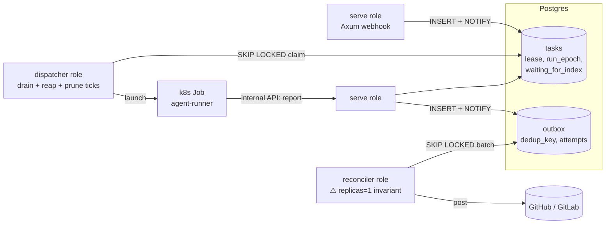
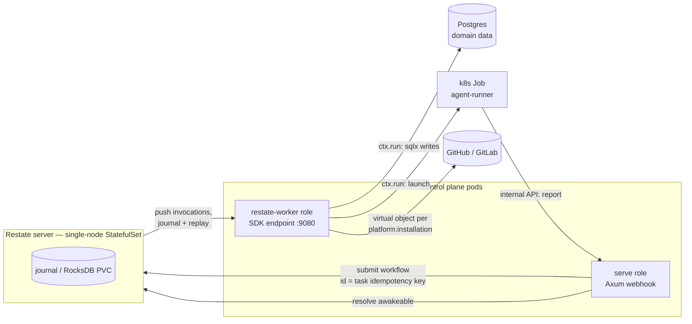
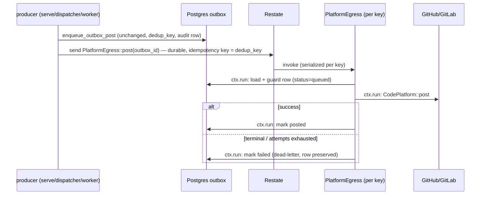

# RFC-0005: Durable task orchestration on Restate (strangler adoption)

- **Status:** Proposed
- **Author(s):** Stephane Segning (@stephane-segning)
- **Date:** 2026-07-09
- **Resulting ADRs:** (filled in on acceptance — anticipated: [ADR-0074](../adr/0074-restate-egress-pilot.md)
  for the Phase A egress pilot; later ADRs for the task-lifecycle workflow and dispatcher retirement)

## Summary

Adopt [Restate](https://restate.dev) as the durable-execution substrate for the control plane's
orchestration, replacing the hand-built Postgres primitives — the `FOR UPDATE SKIP LOCKED` claim
loop, lease/reaper state machine, `LISTEN/NOTIFY` plumbing, and the transactional-outbox drain —
**in phases, behind the existing seams, starting with the smallest one** (platform egress). Postgres
stays the source of truth for all domain data; Restate owns only *execution state* (what step of
which task is in flight, and what happens when the process dies). This RFC amends the later phases
of [RFC-0001](0001-horizontally-scalable-control-plane.md) and is the substrate
[RFC-0006](0006-a2a-agent-surface.md) (A2A support) builds on. It does **not** reopen
[ADR-0029](../adr/0029-focused-review-not-generic-runner.md): the pipeline stays closed and
built-in; only *our own* orchestration code moves onto the engine.

## Motivation

RFC-0001 made the control plane horizontally scalable with stateless roles and a Postgres-backed
queue — deliberately avoiding a broker or workflow platform. That was the right call, and Phases
0–2 shipped. But look at what we own now, spread across
[`queue/dispatcher.rs`](../../services/control-plane/src/queue/dispatcher.rs),
[`queue/reaper.rs`](../../services/control-plane/src/queue/reaper.rs),
[`queue/reconciler.rs`](../../services/control-plane/src/queue/reconciler.rs),
[`outbox.rs`](../../services/control-plane/src/outbox.rs), and ~4,300 lines of
[`db.rs`](../../services/control-plane/src/db.rs):

- a claim protocol (`claim_next_task`, SKIP LOCKED, short leases);
- a failure detector (the reaper: lease expiry × Job liveness → `decide()` → renew / requeue /
  fail, exponential backoff, `MAX_ATTEMPTS`);
- a delivery guarantee (the outbox: idempotent enqueue on `dedup_key`, single-consumer drain,
  `attempts²` backoff, dead-lettering);
- a wakeup fabric (`LISTEN/NOTIFY` on `task_queued`/`outbox`, each with a timer fallback for
  missed notifies);
- an idempotency scheme (`tasks_idempotency_idx`, `run_epoch`, 23505-retry loops);
- a scheduling state (`waiting_for_index`) released by hand-written status transitions.

That **is** a durable-execution engine — hand-rolled, and by now prod-hardened. The motivation to
replace it is *not* that it is broken. It is three-fold:

1. **The remaining RFC-0001 work re-derives the same correctness again.** The `scheduler`
   subcommand (Phase 2, unbuilt), outbox pruning, and every future timer/retry/fan-out feature
   each re-prove safety from SKIP-LOCKED + status-guard first principles. In a one-engineer org,
   that senior-attention tax is the scarcest resource we spend.
2. **Our strongest invariant is documentation-enforced.** The single-replica reconciler
   ([ADR-0059](../adr/0059-reconciler-owns-all-github-egress.md)) is correct only while nobody
   scales the Deployment past 1 — the invariant lives in a comment
   (`reconciler.rs:1-16`) and a Helm value, not in the system's structure. A Restate **virtual
   object** makes per-key serialized egress *structural*: the engine guarantees at-most-one
   running handler per key, regardless of replica count.
3. **A2A needs a third hand-rolled engine — or this one.** RFC-0006 requires long-lived tasks
   with `input-required` pauses, client reattach after disconnect, and push notifications on
   completion. Those are precisely durable promises (awakeables), journaled state, and delayed
   calls. Without an engine we would hand-build durable execution a third time (queue → outbox →
   A2A task store); with it, the A2A task lifecycle is a thin mapping (see RFC-0006).

## Guide-level explanation

Restate is a single-binary durable-execution server. Your code runs as ordinary Rust handlers in
*your* pod (the `restate-sdk` crate serves them over HTTP/2); the Restate server invokes them,
**journals every step**, and replays the journal after a crash so a handler resumes exactly where
it died instead of starting over. Three unit types matter to us:

- **Service** — stateless handlers with durable retries (a durable function call).
- **Virtual object** — handlers keyed by a string; at most one exclusive handler runs per key at
  a time, with per-key K/V state. *This is ADR-0059's single-writer, per key, enforced by the
  engine.*
- **Workflow** — a `run` handler that executes exactly once per workflow ID, with durable
  promises the outside world can resolve. *This is a task's lifecycle.*

### How today's concepts map

| Today (hand-built) | Restate primitive |
|---|---|
| `claim_next_task` + lease + reaper backoff | invocation retries + journal replay |
| `tasks_idempotency_idx` + `run_epoch` + 23505 retry | idempotency keys / workflow ID = task key |
| `waiting_for_index` parking + release-on-index-completion | workflow awaiting a durable promise |
| runner reports completion via internal API | awakeable resolved by the control plane |
| reap / prune / purge timer ticks | durable `ctx.sleep` + delayed calls |
| `LISTEN/NOTIFY` + poll fallback | the server *pushes* invocations; no polling |
| single-replica reconciler invariant | virtual object keyed per `platform:installation` |
| outbox `attempts²` backoff + dead-letter | per-invocation retry policy + explicit dead-letter step |

### What deliberately does *not* change

- **One Kubernetes Job per task** ([ADR-0004](../adr/0004-one-k8s-job-per-task.md)). Restate
  orchestrates *around* the Job; the Job itself, its bootstrap
  ([ADR-0017](../adr/0017-agent-runner-control-plane-bootstrap.md)), and the runner's contents
  are untouched. The runner never talks to Restate — it keeps reporting to the control plane's
  internal API, which resolves the awakeable. The trust boundary
  ([ADR-0002](../adr/0002-rust-control-plane-trust-boundary.md)) is preserved.
- **The closed pipeline** ([ADR-0029](../adr/0029-focused-review-not-generic-runner.md)).
  ADR-0029 rejected Argo/Tekton as *operator-extensible step runners* — arbitrary images over
  untrusted repo content. Restate here is the opposite shape: an internal substrate for our own
  fixed steps, with no operator-defined execution whatsoever. The "heavy platform dependency"
  concern from ADR-0029 §3 is real and is accounted for in Drawbacks, not waved away.
- **Postgres as the source of truth for domain data.** Tasks, runs, findings, transcripts,
  feedback — all stay in Postgres, written from inside handlers (`ctx.run` blocks). Restate's
  journal holds execution position, not domain state. Grafana keeps reading Postgres
  ([ADR-0046](../adr/0046-observability-dashboard-deployment.md)).

### The picture

Today (RFC-0001):

Target (this RFC, fully phased in):

### Phasing (strangler, one seam at a time)

- **Phase 0 — spike.** Single-node Restate via the Helm chart in a dev namespace; one toy
  workflow exercising `ctx.run`+sqlx, an awakeable, a `ctx.sleep`, and a redeploy mid-invocation.
  Verifies server 1.7 ↔ sdk-rust 0.10 compatibility (the published matrix stops at 1.6) and the
  versioning/drain story before any real code moves. *Gate: everything below.*
- **Phase A — egress virtual object** (the pilot, [ADR-0074](../adr/0074-restate-egress-pilot.md)).
  Replace the reconciler's outbox *drain* with a `PlatformEgress` virtual object keyed
  `platform:installation_or_project`. The `outbox` table remains as the audit record and
  dead-letter destination. Smallest blast radius: a failure delays or dead-letters a PR comment;
  it never loses a review run.
- **Phase B — task lifecycle workflow.** One workflow per task (`id` = the idempotency key +
  `run_epoch`): dedup → wait-for-index (durable promise) → launch Job (`ctx.run`) → await runner
  completion (awakeable, with a timeout racing `activeDeadlineSeconds`) → hand egress to Phase A.
  Cutover runs both systems side by side keyed by task-creation date; in-flight legacy tasks
  drain on the old path.
- **Phase C — retire the scaffolding.** Dispatcher drain/reap/prune ticks, lease columns, the
  `waiting_for_index` status, `LISTEN/NOTIFY` wakeups, and the never-built `scheduler` subcommand
  are deleted or reduced to Restate-driven equivalents. RFC-0001's remaining phases are closed as
  superseded.

Each phase gets its own ADR; a later phase can be abandoned without unwinding an earlier one.

## Reference-level explanation

### Deployment & registration

- **Server:** `oci://ghcr.io/restatedev/restate-helm`, single-replica StatefulSet in the
  `converse` namespace, RocksDB on a PVC, `rocksdb-total-memory-size` ≈ 75 % of pod memory
  (docs sizing example: 1 CPU / 4 Gi). Added to ai-helm and delivered by ArgoCD like everything
  else ([ADR-0055](../adr/0055-review-waits-for-index-readiness.md) GitOps posture). No S3, no
  Raft — multi-node is explicitly out of scope until a scaling need exists.
- **Worker:** a new `restate-worker` role in the existing control-plane binary
  ([`main.rs`](../../services/control-plane/src/main.rs) role dispatch), running the SDK's hyper
  endpoint on `:9080` plus the usual metrics-only Axum listener. Its own Deployment: the SDK has
  no Tower/Axum adapter, and co-locating with `serve` would couple journal-drain cycles to every
  webhook-path redeploy. The Restate **operator** (or `restatectl` in CI) registers each new
  deployment revision; Restate pins in-flight invocations to the revision they started on and
  drains old ones (immutable-deployment model).
- **License:** server is BSL 1.1 with an additional-use grant that permits internal production
  deployments invoking your own services (only reselling "Restate-as-a-platform" is excluded);
  converts to Apache-2.0 four years per release. SDKs are MIT. No exposure for our use.

### Phase A: the `PlatformEgress` virtual object

Key = `"{platform}:{installation_or_project_id}"` — the same granularity GitHub/GitLab rate
limits apply at, so per-key serialization is also the rate-limit alignment.

Mechanics and guards:

- The producer side (`enqueue_outbox_post`, all `outbox.rs` shaping,
  [ADR-0056](../adr/0056-control-plane-owns-the-posted-output.md)) is unchanged: intent rows are
  still written first, in the same transaction as the domain write where applicable. Restate's
  `send` carries only the `outbox_id`; payloads never enter the journal (keeps journal entries
  small; the row is re-read inside `ctx.run`).
- Retries: Restate's per-invocation retry policy replaces `mark_outbox_failed`'s `attempts²`
  schedule; after the configured ceiling the handler takes the explicit dead-letter branch (a
  `TerminalError` path), so nothing retries forever against a deleted PR.
- The reconciler role keeps its *inbound* half (the 👍/👎 feedback poll,
  [ADR-0035](../adr/0035-review-feedback-signal.md)) — only the outbound drain moves. A
  follow-up may move the poll to a Restate cron-style delayed call; not part of the pilot.
- **Rollback:** a config flag flips producers back to NOTIFY-only; the reconciler drain code is
  kept intact (not deleted) for the entire pilot. The outbox table is the shared ledger both
  paths understand, so switching direction mid-stream is safe — any row not marked posted is
  picked up by whichever consumer is active. Dual-consumer overlap is excluded by the same
  status guards that already make the drain idempotent.

### Phase B: the task lifecycle workflow

Workflow ID = the existing idempotency tuple + `run_epoch` (so "exactly one workflow per task"
is the same dedup we have today, enforced by workflow-instance uniqueness instead of a partial
unique index). Sketch of `run`:

1. `ctx.run`: create/attach the `tasks` row (status column becomes derived/reporting-only).
2. If a non-index task and an index is in flight: await a durable promise the index-task
   workflow resolves on completion — replacing `INITIAL_TASK_STATUS_SQL` parking and the release
   transition.
3. `ctx.run`: `TaskLauncher::launch` (idempotent by `job_name`, as today).
4. Await the **runner-completion awakeable**, racing a durable timer set to
   `activeDeadlineSeconds` + slack. The runner's existing report to the internal API
   (`http/internal.rs`) resolves the awakeable — the runner's contract does not change, and it
   still holds no Restate credentials ([ADR-0017](../adr/0017-agent-runner-control-plane-bootstrap.md)).
   Timeout branch = today's reaper `decide()` logic (check Job liveness via `ctx.run`, then
   requeue-as-new-invocation or fail + failure notice via Phase A).
5. `ctx.run`: finalize domain rows; hand egress intents to `PlatformEgress`.

Migration: new tasks (by creation timestamp / config flag) go to workflows; the dispatcher keeps
draining old-style rows until empty, then Phase C deletes it. The `tasks` table is **not**
migrated in place — both systems write the same rows, one owns any given task.

### Determinism rules the codebase must adopt (Phase A onward)

These are the Restate programming-model constraints, recorded here so reviews can enforce them:

- **All I/O inside `ctx.run`** — every sqlx query, `CodePlatform` call, k8s API call. Results
  are journaled; on replay the closure is *not* re-executed. Consequence: `ctx.run` results must
  be small (ids and status enums, not transcripts or diffs).
- **No Context use inside `ctx.run`** (SDK constraint — no nested journal ops).
- **Handler code outside `ctx.run` must be deterministic** — no wall-clock reads, no RNG, no
  config re-reads that may differ across replays; use `ctx.sleep`/journaled values instead.
- **No concurrent Context fan-out** until [sdk-rust #89](https://github.com/restatedev/sdk-rust/issues/89)
  (buffered-stream freeze) is resolved; if concurrency is needed, only the SDK's own
  `DurableFuturesUnordered` (0.10+) is permitted.
- **Journal-compatible evolution:** changing the order/set of journaled steps in a handler with
  in-flight invocations is a breaking change managed by deployment versioning (register new
  revision, drain old). Handlers stay short; anything long-lived hangs on an awakeable, not a
  long code path — this is also what keeps the 2 h deep-review tier cheap to hold open.
- **Version pins:** `restate-sdk` is 0.x with breaking minors; pin exactly in the workspace
  `Cargo.toml`, upgrade deliberately alongside a server-compat-matrix check.

## Drawbacks

Owning a workflow engine's *operational* surface is the price for deleting our hand-rolled one:
one more stateful pod (RocksDB PVC) in a GitOps flow that until now had exactly two stateful
things (Postgres, Neo4j); a new mental model (journaling, replay, immutable deployments) for a
codebase that one person maintains; and a migration window in which **two orchestration systems
run side by side** and every incident starts with "which path was this task on?". The Rust SDK is
the junior sibling (0.10 vs TS 1.16 / Java 2.9, "might break across releases" in its own README,
78 stars) — we would be betting a core subsystem on the least-mature client of an otherwise
mature server. And the strangler only pays off if it completes: stalling after Phase A leaves us
maintaining both the reaper *and* an engine.

### Risk factors

| # | Risk | Likelihood | Impact | Mitigation |
|---|---|---|---|---|
| R1 | sdk-rust breaking changes on 0.x minors outpace us | High | Medium | Pin exactly; upgrade on our cadence with the compat matrix; handlers are thin so churn surface is small |
| R2 | [sdk-rust #89](https://github.com/restatedev/sdk-rust/issues/89): concurrent Context use freezes a handler | Medium | High (stuck invocations) | Forbid fan-out in handlers (review rule above); `DurableFuturesUnordered` only; watch the issue before Phase B |
| R3 | Server 1.7 ↔ SDK 0.10 compat unverified (matrix stops at 1.6) | Medium | Medium | Phase 0 spike pins both and tests explicitly; hold server at 1.6 if needed |
| R4 | Journal replay vs code evolution: a hotfix breaks in-flight 2 h deep reviews | Medium | Medium | Immutable-deployment versioning + operator drain; short handlers, awakeables for long waits; rollout rule: never edit a handler's journaled step sequence in a patch release |
| R5 | RocksDB PVC loss / corruption loses execution position | Low | High | Domain truth stays in Postgres — recovery = re-submit unfinished tasks from `tasks` rows (the same reconciliation the reaper does today); PVC snapshots via the storage class |
| R6 | Restate server outage halts all orchestration (new single point of failure) | Low–Med | High | Single-node server is a supervised StatefulSet (restart = journal replay, no loss); webhook ingress (`serve`) keeps accepting + persisting intent rows, so work queues up rather than drops; documented runbook before Phase B |
| R7 | Split-brain between journal state and Postgres rows (e.g. `ctx.run` wrote, then crash before journal ack) | Medium | Medium | `ctx.run` blocks are idempotent (status-guarded UPDATEs, upserts — the codebase already writes this way); treat journal as driver, Postgres as record |
| R8 | Migration-window confusion (two paths) during Phase B | High | Medium | Hard partition by task-creation flag; `run_config_b64`-style stamping of which engine owns a run; dashboards show engine per task |
| R9 | BSL license shifts or use-grant reinterpretation | Low | Low | Grant explicitly covers internal use; 4-year Apache-2.0 conversion bounds worst case; SDKs are MIT |
| R10 | The pilot succeeds but Phase B/C never lands (permanent dual system) | Medium | Medium | Phase A is chosen to be *independently* valuable (deletes the replicas=1 invariant); explicit go/no-go review written into ADR-0074 |

## Alternatives

- **Do nothing / finish RFC-0001 by hand.** Cheapest short-term and the code is proven. But the
  scheduler, outbox pruning, A2A task store, and every future timer still get hand-built, and
  the replicas=1 invariant stays social. This is the real competitor; the RFC's claim is that
  the *third* re-derivation (A2A) tips the balance.
- **Temporal.** The mature choice ecosystem-wise, but the server is a heavy multi-service
  deployment (or their cloud), and `sdk-core`-based Rust support is itself pre-1.0 — we would
  take on more infrastructure for an equally immature Rust story.
- **DBOS.** Postgres-native durable execution (no new stateful service — attractive given our
  posture), but its first-class SDKs are TypeScript/Python; no production-grade Rust library.
  Worth re-checking if the Restate spike fails on SDK grounds.
- **Argo Workflows / Tekton.** Already rejected by [ADR-0029](../adr/0029-focused-review-not-generic-runner.md)
  for this codebase's shape; nothing has changed — they orchestrate pods, not in-process durable
  logic, and would not give us awakeables/virtual objects.
- **A message broker (NATS/Kafka) + hand-rolled sagas.** Adds the stateful infra *without* the
  execution journal; we would still own all retry/replay logic. Strictly worse than either
  extreme.

## Unresolved questions

- Server 1.7 ↔ sdk-rust 0.10 compatibility (Phase 0 spike answers this).
- Operator vs `restatectl`-in-CI for deployment registration under ArgoCD (the operator also
  automates drains; but it is a second controller in the cluster — evaluate in the spike).
- Whether the `outbox` table remains permanently as audit/dead-letter or is eventually replaced
  by Restate's introspection surface (out of scope for Phase A; revisit in Phase C).
- Exact Phase B cutover mechanics for `waiting_for_index` across engines (an index task on the
  old path must still release a workflow-parked review task — likely via the promise being
  resolved from the internal API rather than engine-to-engine).
- Multi-node Restate (S3 + replication) — explicitly out of scope; single-tenant load does not
  need it.
