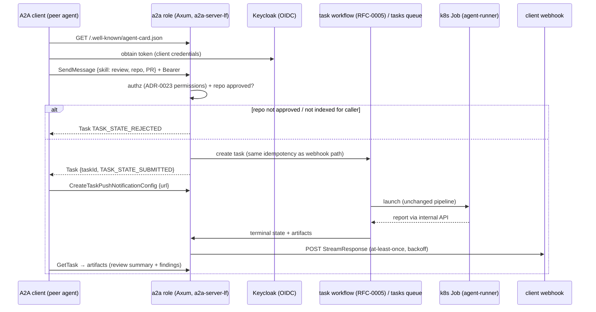
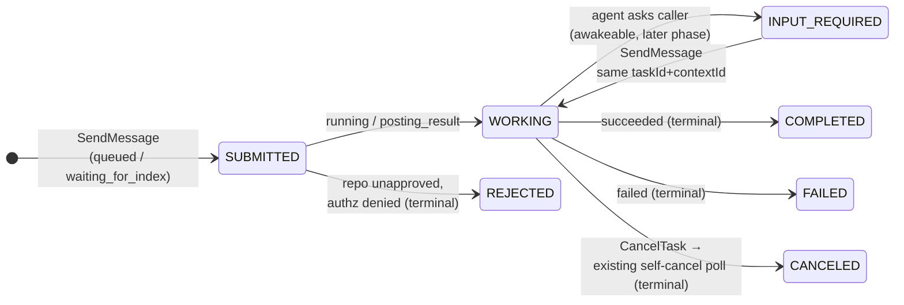

# RFC-0006: A2A-compliant agent surface

- **Status:** Proposed
- **Author(s):** Stephane Segning (@stephane-segning)
- **Date:** 2026-07-09
- **Resulting ADRs:** (filled in on acceptance — anticipated: an ADR for the A2A ingress role +
  binding/SDK choice, and an ADR for push-notification egress + SSRF policy;
  [ADR-0075](../adr/0075-rig-for-new-agent-surfaces.md) already covers the agent framework for
  the conversational surface)

## Summary

Expose Lightbridge's agents over the [A2A protocol](https://a2a-protocol.org/latest/specification/)
(Agent2Agent, Linux Foundation, **spec v1.0.1**, 2026-05-28) as an **A2A server**: an agent card at
`/.well-known/agent-card.json`, a `review` skill (request a deep review of a PR) and an `ask`
skill (conversational Q&A over an indexed repo), with task lifecycle, streaming, and push
notifications mapped onto our existing task model. Phase 1 (card + send + poll) rides today's
Postgres queue; the durable phases (reconnectable streams, `input-required` pauses, reliable
webhooks) ride the Restate substrate from
[RFC-0005](0005-durable-orchestration-on-restate.md). Client identity is our existing Keycloak
OIDC ([ADR-0014](../adr/0014-keycloak-oidc-resource-server.md) /
[ADR-0023](../adr/0023-db-backed-rbac.md)); the repo approval gate and the closed pipeline
([ADR-0029](../adr/0029-focused-review-not-generic-runner.md)) are unchanged — A2A adds a client
*protocol*, not new execution.

## Motivation

Today Lightbridge has exactly one inbound trigger surface: forge webhooks + `@mention` comments
([ADR-0033](../adr/0033-inbound-command-parsing-and-run-kinds.md)). That made sense when the only
caller was a human on a PR page. The agent ecosystem is consolidating on A2A as the way agents
call agents: the spec hit v1.0 (2026-03) under the Linux Foundation with AWS (Bedrock AgentCore
serves A2A natively), Microsoft (Foundry inbound A2A in preview, Work IQ API *is* A2A), and
Google (Vertex AI Agent Engine) shipping server surfaces — and, directly relevant to our
multi-forge direction ([ADR-0072](../adr/0072-platform-abstraction-layer.md), #253), **GitLab has
publicly committed Duo Agent Platform to A2A interop** for its agent catalog. Meanwhile no
mainstream code-review agent exposes an A2A server yet.

Concretely, A2A support means:

- **Lightbridge becomes callable as a peer agent.** An orchestrator (a platform team's internal
  agent, a Duo/Foundry/AgentCore-hosted agent, CI tooling) can request a review or ask a
  repo-grounded question *without impersonating a human commenter* — with a real task handle it
  can poll, stream, reattach to after a disconnect, or get a webhook for. Our deep reviews run
  up to 2 h ([ADR-0062](../adr/0062-two-tier-review-fast-auto-deep-on-demand.md)); "fire, drop
  the connection, get notified" is precisely the delivery model the spec builds in.
- **The protocol's task semantics match machinery we already have** — and the gaps are exactly
  what RFC-0005 adds. A2A wants durable server-generated task IDs (we have tasks + `run_epoch`
  idempotency), idempotent submission, an `input-required` pause state (Restate awakeables),
  at-least-once webhooks with retry (the outbox/egress discipline of
  [ADR-0059](../adr/0059-reconciler-owns-all-github-egress.md) → RFC-0005 Phase A), and
  reconnectable ordered event streams (a per-task event log, which our transcript
  [ADR-0034](../adr/0034-agent-run-transcript-and-observability.md) is 80 % of).
- **It gives the `ask` run kind a real home.** Conversational runs today are shoehorned into PR
  comments. As an A2A skill with a `contextId` (the spec's conversation grouping), `ask` becomes
  a first-class, multi-turn surface — the new-agent work [ADR-0075](../adr/0075-rig-for-new-agent-surfaces.md)
  equips.

Why now rather than when someone asks: the mapping work shapes RFC-0005's Phase B design (what
the task workflow must expose), and being early on an interop standard is cheap — the surface is
small — while being late means retrofitting.

## Guide-level explanation

A2A in one paragraph: a server publishes an **agent card** (JSON at
`/.well-known/agent-card.json`) describing its skills, transports, and auth requirements. A
client sends a message (`SendMessage`); the server replies with a **Task** carrying a
server-generated `taskId` and a state (`TASK_STATE_SUBMITTED` → `TASK_STATE_WORKING` → terminal
`TASK_STATE_COMPLETED`/`FAILED`/`CANCELED`/`REJECTED`, with interrupt states
`TASK_STATE_INPUT_REQUIRED`/`AUTH_REQUIRED`). The client then polls (`GetTask`), streams
(`SendStreamingMessage`/`SubscribeToTask`, SSE), or registers a **push-notification webhook**.
Results are **artifacts** (typed parts: text/raw/url/data). A `contextId` groups related tasks
into a conversation. MCP and A2A are complementary by the projects' own framing: MCP is
agent-to-*tool*, A2A is agent-to-*agent* — our agents keep using MCP tools internally
([ADR-0066](../adr/0066-deep-tier-external-knowledge-tools.md)) while A2A is how *other agents
reach us*.

### What a caller sees

### State mapping (theirs ↔ ours)

| A2A (v1.0 wire values) | Lightbridge |
|---|---|
| `TASK_STATE_SUBMITTED` | `queued`, `waiting_for_index` |
| `TASK_STATE_WORKING` | `running`, `posting_result` |
| `TASK_STATE_COMPLETED` / `FAILED` / `CANCELED` | `succeeded` / `failed` / `cancelled` |
| `TASK_STATE_REJECTED` | repo-approval/authz refusal at submission |
| `TASK_STATE_INPUT_REQUIRED` | RFC-0005 awakeable pause (Phase 4 here) |
| `TASK_STATE_AUTH_REQUIRED` | not used initially (auth is upfront OIDC) |
| `taskId` (server-generated, §3.4) | task id (+ `run_epoch` behind it) |
| `contextId` (conversation) | PR thread / `ask` conversation |
| artifacts (parts) | review summary + findings (`data` parts), transcript pointer |

### Skills (initial card)

> **See also:** [Calling the A2A `review` skill](../a2a-review-skill.md) — the concrete calling
> guide (token, `SendMessage` wire form, the input field table, `GetTask` polling, and the wire
> gotchas). The same input schema is published inline in the card's `review` skill `description`.

- **`review`** — input: forge, repo, PR reference (+ optional focus prompt); runs the **deep**
  tier ([ADR-0062](../adr/0062-two-tier-review-fast-auto-deep-on-demand.md)) through the
  *identical* pipeline as an `@mention`: same idempotency, same approval gate, same mediated
  posting to the PR ([ADR-0037](../adr/0037-agent-acts-via-mediated-tools.md)). The A2A
  artifacts are *additionally* returned to the caller (summary + structured findings), they do
  not replace the PR review.
- **`ask`** — repo-grounded Q&A (the ADR-0033 conversational kind), served by the new
  Rig-based agent ([ADR-0075](../adr/0075-rig-for-new-agent-surfaces.md)), multi-turn via
  `contextId`.

## Reference-level explanation

### Ingress: a new `a2a` role

A new role in the control-plane binary (same pattern as `serve`/`dispatcher`/`reconciler`,
[`main.rs`](../../services/control-plane/src/main.rs)), its own Deployment + Ingress host. Build
on the **official Rust SDK** (`a2a-lf` 0.3.0 / `a2a-server-lf` 0.4.0, Apache-2.0,
[a2aproject/a2a-rs](https://github.com/a2aproject/a2a-rs)) — it is Axum-native, which drops
straight into our stack, targets spec v1, and covers JSON-RPC + REST + SSE so we don't hand-roll
binding plumbing. It is young (0.x, ~3 months) — an accepted risk (R2 below) with a source-read
gate: before committing, verify its task-store abstraction is pluggable enough to back with our
Postgres/Restate state rather than an in-memory store. If it isn't, the fallback is implementing
the REST binding directly in Axum (the surface is ~9 endpoints; the spec makes every binding
optional, §5.2, so REST + SSE alone is compliant).

Spec-v1.0 details we must get right (most online material still shows 0.2/0.3 shapes):
PascalCase JSON-RPC method names (`SendMessage`, `GetTask`, …), SCREAMING_SNAKE enum wire
values, no `kind` discriminators, `supportedInterfaces[]` on the card, REST media type
`application/a2a+json`, `A2A-Version` header, and the card at `agent-card.json` (not
`agent.json`).

### Identity, authz, and the approval gate

- The card's `securitySchemes` declares OIDC against our Keycloak realm; callers are **service
  accounts** (client-credentials), first-party or explicitly provisioned — there is no
  anonymous access, and `GetExtendedAgentCard` (if served) requires auth per spec §13.3.
- The token's permission claims ([ADR-0023](../adr/0023-db-backed-rbac.md)) gate per-skill use
  (e.g. `a2a:review`, `a2a:ask`) — the same enforcement style as the admin surface. This also
  meshes with the per-identity model/ACL direction (ADR-0038 expansion, #241): an A2A caller is
  just another identity with an allowlist.
- **Repo approval is unchanged and checked at submission**: a task against an unapproved (or
  never-indexed) repo is answered with `TASK_STATE_REJECTED` — A2A cannot become a side door
  around the approval gate ([ADR-0063](../adr/0063-cli-only-repository-approval.md)).
- `tenant` (v1.0 multi-tenancy) is not used initially — single-tenant deployment; requests
  carrying a tenant are rejected as unsupported.

### Task plumbing per phase

- **Phase 1 — card + `SendMessage` + `GetTask` + `CancelTask`, polling only.** Runs entirely on
  the existing Postgres queue: submission calls the same task-creation path as the webhook
  handler (same `tasks_idempotency_idx`/`run_epoch` semantics — an A2A review of the same
  head SHA dedups against a webhook-triggered one, and the spec's idempotent-submission
  expectation is satisfied by construction). `GetTask` is a status read; `CancelTask` sets the
  cancel flag the runner already polls. A small `a2a_tasks` mapping table pins
  `taskId`/`contextId`/caller identity/push configs to our task rows. **No RFC-0005 dependency.**
- **Phase 2 — streaming (`SendStreamingMessage`, `SubscribeToTask`).** Requires an **ordered
  per-task event log** (spec §3.5.2: multiple concurrent subscribers must see identical ordered
  events; reconnect must replay from the log, and the stream closes at terminal state). New
  `task_events` table (append-only, sequence-numbered), fed by the existing status transitions
  + coarse progress events the transcript already captures (ADR-0034). SSE handlers replay from
  the log then tail it — no fan-out state in the pod, so the role scales horizontally.
- **Phase 3 — push notifications.** Webhook delivery is *egress* and follows the house egress
  discipline: intent rows + the RFC-0005 Phase A `PlatformEgress` pattern (a `WebhookEgress`
  virtual object or, pre-Restate, an outbox kind) — at-least-once, exponential backoff, 10–30 s
  timeout, dead-letter. **SSRF policy is mandatory** (spec §13.2 SHOULD; for us a MUST):
  registered webhook URLs must be HTTPS, resolve to public addresses (reject RFC 1918,
  localhost, link-local — the role runs *inside* the cluster, so an unvalidated URL is a probe
  into `converse` and beyond), and are re-validated at delivery time (DNS rebinding). Config
  CRUD per spec (`CreateTaskPushNotificationConfig` etc., multiple configs per task). Designed in
  [ADR-0079](../adr/0079-a2a-push-notifications-webhook-egress.md).
- **Phase 4 — `input-required` + `ListTasks`.** Requires RFC-0005 Phase B: the task workflow
  parks on an awakeable carrying a question artifact; the continuation is a `SendMessage` with
  the same `taskId`+`contextId` (spec §3.4), which resolves the awakeable. This unlocks
  human/agent-in-the-loop review flows (e.g. "this PR touches a migration — confirm the intent
  before I judge it") that have no home in the webhook model. `ListTasks` (cursor-paginated) is
  a filtered read over the caller's own tasks. Designed in
  [ADR-0081](../adr/0081-a2a-input-required-and-list-tasks.md) (ListTasks decoupled and shippable
  first; `input-required` gated on RFC-0005 Phase B / ADR-0076).

Deliberately deferred: signed agent cards (JWS/JCS, §8.4 — add when a counterparty requires
verification), gRPC binding, A2A *client* capability (Lightbridge calling other agents — a
separate proposal if ever; nothing here precludes it), extensions (§4.6).

### What does not change

The runner, the pipeline, and the trust boundary are untouched: A2A never reaches the Job — it
is a fourth face on the control plane (webhook, admin, internal, A2A), and the closed-pipeline
boundary of [ADR-0029](../adr/0029-focused-review-not-generic-runner.md) holds (a skill is a
*named entry point to existing behavior*, not operator-defined execution). Egress to forges
stays on the ADR-0056/0059 path; A2A artifacts are an additional, caller-scoped output.

## Drawbacks

This is a second protocol surface to own — auth, versioning, conformance, and abuse handling for
a standard that reached 1.0 four months ago and whose Rust SDK is younger than that. Until real
peers call it, the card and endpoints are speculative interop: the bet is bounded (Phase 1 is a
thin adapter over existing task plumbing) but nonzero. It also makes deep-tier compute
reachable by machines: a misbehaving authorized client can queue expensive 2 h runs far faster
than humans commenting on PRs ever could, so quota enforcement stops being theoretical.

### Risk factors

| # | Risk | Likelihood | Impact | Mitigation |
|---|---|---|---|---|
| R1 | Spec churn post-1.0 (1.0.1 already patched bindings); stale-tutorial confusion (0.2/0.3 shapes everywhere) | Medium | Medium | Pin to v1.0.1 via the proto-derived types in `a2a-lf`; conformance tests against `specification/a2a.proto` shapes; card declares `protocolVersion` per interface |
| R2 | `a2a-server-lf` 0.x immaturity; task-store abstraction may not fit our Postgres/Restate backing | Medium | Medium | Pre-adoption source read (gate in the resulting ADR); fallback = direct REST+SSE binding in Axum (~9 endpoints, spec-compliant since bindings are optional) |
| R3 | SSRF via push-notification configs from inside the cluster | Medium | High | HTTPS-only + public-address validation at registration *and* delivery, no redirects-to-private, egress via the disciplined outbox path, dedicated NetworkPolicy for the delivery pod |
| R4 | Cost/abuse: authorized-but-noisy clients queueing deep runs | Medium | High | Per-identity quotas + rate limits at the `a2a` role; deep-tier runs bill to the caller identity in the cost dashboards (per-run model+tokens already tracked); `REJECTED` on quota breach |
| R5 | Dual-trigger identity confusion (same PR reviewed via webhook and A2A) | High | Low–Med | Same idempotency tuple by construction (dedups to one run); `a2a_tasks` maps callers onto runs; transcript records the trigger source |
| R6 | Streaming ordering/fan-out bugs (spec requires identical ordered events across subscribers) | Medium | Medium | Event-log-then-tail design (no in-memory fan-out state); sequence numbers asserted in tests; stream close on terminal state |
| R7 | Phase 4 semantics without RFC-0005 (if Restate stalls) | Medium | Medium | Phases 1–3 are Postgres-only by design; Phase 4 is explicitly gated on RFC-0005 Phase B — worst case we ship a polling+webhook A2A server without `input-required`, which is still compliant |
| R8 | Adoption never materializes (we built an unused door) | Medium | Low | Phase 1 is small and reuses the task path; GitLab Duo interop (#253 direction) and MS/AWS surfaces are the demand signal; stop-loss: don't build Phases 2–4 until a real peer uses Phase 1 |
| R9 | New authenticated ingress = new attack surface (token handling, JSON parsing of hostile peers) | Medium | Medium | Same OIDC middleware as admin surface (ADR-0014/0023); strict payload limits; the role holds no forge credentials (egress stays on the reconciler/Restate path) |

## Alternatives

- **MCP-only exposure** — wrap `review`/`ask` as tools on an MCP server (we already run MCP
  infrastructure, [ADR-0020](../adr/0020-mcp-servers-via-control-plane.md)/
  [ADR-0066](../adr/0066-deep-tier-external-knowledge-tools.md)). Genuinely cheaper, and the
  right answer if the only consumers are *our own* loops. But MCP tool calls are
  request-scoped: no durable task handle, no reattach, no `input-required`, no webhooks — for a
  2 h review the caller must hold a connection or we invent task semantics on top, i.e. rebuild
  A2A's task model privately (the projects' own complementarity framing, spec Appendix B).
  Rejected as the *interop* answer; an MCP facade can still be added trivially later since both
  front the same task plumbing.
- **Bespoke REST API.** Maximum control, zero interop — every peer needs custom integration,
  which is the situation A2A exists to end. Rejected.
- **Do nothing until a partner demands it.** Defensible, but the cheap part (Phase 1) is also
  the part that shapes RFC-0005 Phase B correctly; retrofitting task-handle semantics after the
  workflow design lands costs more than mapping them now. The stop-loss in R8 captures the
  sensible half of this alternative.
- **A2A v0.3 compatibility layer as well as v1.0.** Some ecosystems still speak 0.x. Rejected:
  dual-version surface for a pre-stability spec is churn we don't need; v1.0-only, revisit on
  demand.

## Unresolved questions

- `a2a-server-lf` task-store pluggability (the R2 source read) — answered before the resulting
  ADR is written.
- Binding set for the card: REST+SSE only, or JSON-RPC too (both cheap via the SDK; decide on
  what early peers actually speak — Bedrock AgentCore does JSON-RPC passthrough).
- Artifact schema for `review` results (findings as one `data` part vs per-finding artifacts;
  alignment with the existing finding format of ADR-0032) — implementation detail, decided with
  the first consumer.
- Whether `ask` conversations get durable memory (ties into RFC-0004's external memory service)
  or stay stateless per `contextId` initially.
- Where the `a2a` role's Ingress host lives relative to the Grafana/oauth2 host plan
  (ADR-0064) — an ai-helm concern, not a protocol one.
