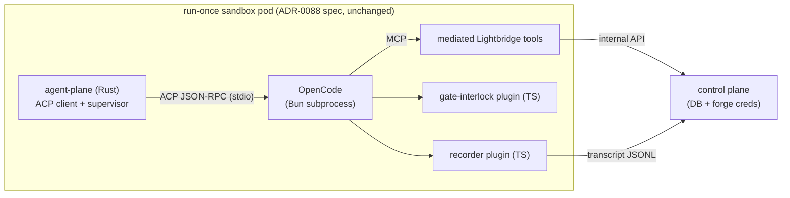

# RFC-0009: OpenCode-over-ACP as the agent-loop host (plugins own recording and gate enforcement)

- **Status:** Draft
- **Author(s):** @stephane-segning
- **Date:** 2026-07-16
- **Resulting ADRs:** [ADR-0094](../adr/0094-opencode-acp-open-mode-host.md) (open-mode host),
  [ADR-0095](../adr/0095-opencode-plugins-recording-and-gates.md) (plugins own recording + gates),
  [ADR-0096](../adr/0096-mediated-forge-read-tools.md) (mediated forge reads), and
  [ADR-0097](../adr/0097-review-runs-on-opencode.md) (the `review`-mode cutover).
- **⚠️ Amended 2026-07-16:** the [Phasing](#phasing) below is **superseded by
  [ADR-0097](../adr/0097-review-runs-on-opencode.md)**. The owner reversed Phase 2/3: rather than
  block the `review` cutover on the (still-unbuilt) #252 eval harness, the review host was built ahead
  of it and gated on a **shadow parity run** instead. The phasing text is kept for historical intent.

## Summary

Host the agent loop in **OpenCode**, driven over the **Agent Client Protocol (ACP)** from the Rust
agent-plane, instead of extending our native Rust loop to new modes. OpenCode owns the LLM loop,
provider quirks, MCP client, and subagent orchestration; **we** own the trust boundary (unchanged —
mediated tools via the control plane), the transcript (a first-party **recorder plugin**), and the
quality gates (a first-party **gate-interlock plugin**). Durable step replay
([ADR-0087](../adr/0087-durable-replay-checkpoint-runtime.md)) is **deliberately dropped** for
OpenCode-hosted modes: it has never been exercised in production (Passthrough has been the standing
default since it merged), and by the [ADR-0093] go/no-go lesson — judge a mechanism by whether its
rationale is exercised — it does not earn a veto over this architecture. First-party plugins live
under **`integrations/opencode/plugins/*`**.

## Motivation

### The maintenance trade, stated honestly

We have now built and maintained a native agent loop through three architectural generations
(ADR-0026 native loop → ADR-0082 R1 crate family → RFC-0007 agent-plane). The costs are no longer
hypothetical:

- **We own the wire.** Issue #411 — reasoning silently dropped because an explicit
  `"tool_calls":null` failed a whole-chunk serde parse in `stream.rs` — took a multi-PR arc
  (#425/#427/#429) to root-cause and fix. That entire bug *class* (provider wire-format drift vs.
  our hand-rolled structs) transfers to OpenCode's maintainers, who ride the Vercel AI SDK's
  provider layer exercised across a very large install base.
- **We own the MCP client, the subagent orchestration we don't yet have, and every provider quirk.**
  Each is table stakes in OpenCode and a backlog item for us.
- **The ecosystem is TypeScript.** The company already runs OpenCode day-to-day; our existing
  plugin investment (e.g. `vymalo/opencode-oauth2`) carries over; and the escape hatch for any gap
  is *a small TypeScript plugin* rather than Rust wire-level work — an afternoon instead of the
  #411 arc.

This is a **trade, not a free lunch** — see [Drawbacks](#drawbacks). We are consciously moving
loop complexity toward OpenCode's maintainers and accepting a dependency on their pace.

### Why the previous rejections no longer bind

This is the **third** time OpenCode is on the table, so the burden of proof is on this RFC:

1. **ADR-0021 → [ADR-0026](../adr/0026-native-review-agent.md) (2026-06):** OpenCode was dropped
   because we scraped the review from free-text stdout (fragile) and had no control over the loop.
   **Both objections are answered structurally today:** ACP is a structured JSON-RPC session
   protocol (no stdout scraping — tool calls, permission requests, and message parts are typed
   updates), and the plugin hook surface (`tool.execute.before/after`, `permission.ask`,
   `chat.params`, `experimental.chat.*.transform`) gives us programmatic control points *inside*
   the loop that `opencode run` never exposed.
2. **ADR-0082 §Alternatives (2026-07-11):** rejected on three pillars. **(i) Replay:** "no replay
   verb, session state pod-local" — this RFC *drops replay deliberately* (below), so the pillar is
   moot. **(ii) Enforced gates would regress to honor-system prompts:** the plugin contract
   supports an **enforced interlock** — `tool.execute.before` can *throw*, so the terminal tool
   (`submit_findings` / `propose_pr`) is mechanically blocked until gate preconditions
   (e.g. refute-pass calls, [ADR-0091](../adr/0091-refute-pass-outward-disconfirmation-search.md))
   are actually observed in the session. Block-until is a different shape from the native loop's
   `TurnFilter::force_names()` force-now, but it is *enforcement*, not persuasion — the model
   cannot game a tool that refuses to execute. **(iii) Reasoning-fidelity (the ADR-0075 class):**
   downgraded from blocker to probe item — company-scale daily OpenCode use shows healthy reasoning
   streaming, and the fallback is a plugin subscribing to reasoning message parts. The probe
   (Phase 0) verifies it rather than assuming it.
3. **What we are NOT re-running:** the honor-system regression that ADR-0026 reversed. If Phase 0
   shows the interlock cannot be enforced (hooks can't block, state can't be tracked), this RFC
   fails its gate and we stop.

### Dropping replay is a decision, not an omission

[ADR-0087](../adr/0087-durable-replay-checkpoint-runtime.md)'s `CheckpointRuntime` merged fully
built — and has run **zero** production tasks: `Passthrough` is the standing default, gate #363
never graduated, and the one time replay semantics were exercised at all (the PR #423 telemetry
bug) it *found a latent data-loss class* rather than delivering value. The [ADR-0093] Restate
lesson applies verbatim: a mechanism whose rationale is never exercised is a no-go regardless of
how clean it looks. OpenCode-hosted modes therefore run **restart-on-failure** (the fast tier's
long-standing posture, now for all hosted modes): a crashed task re-runs from the top, and the
egress plane's existing dedup keys (`(task_id, run_epoch)` on `add_comment` / `propose_pr` /
`finalize`) make the at-least-once writes safe — that discipline predates replay and survives it.
Ticket #430 (step reproducibility) must be re-framed against this RFC if accepted.

## Guide-level explanation

The **agent-plane keeps its job and its trust boundary; the loop inside it changes hands.**



- The **Rust agent-plane binary stays** — it is now a *supervisor*: it prepares the checkout,
  renders the per-task OpenCode config, spawns `opencode acp` inside the same sandbox pod,
  drives the session over ACP (prompt in, updates out, permission requests answered by policy),
  enforces wall-clock/turn budgets, and reports lifecycle to the control plane exactly as today.
- **Every Lightbridge capability is an MCP tool** served by the control plane's existing `mcp`
  ingress ([RFC-0007](0007-control-plane-v2-planes.md)) or a task-local stdio server: retrieval
  (`vector_semantic_search`, `graph_*`, ADR-0090's hybrid search), and the **terminal/control
  tools** (`submit_findings`, `propose_pr`, `report_progress`, `abort`). The payload keeps being
  validated at a tool boundary — ADR-0026's "no stdout scraping" property survives the host swap.
- **The trust boundary does not move.** OpenCode runs *inside* the ADR-0088 sandbox with exactly
  the credentials the native loop held: LLM-gateway key + task-scoped runner token
  ([ADR-0092](../adr/0092-per-task-runner-tokens.md)). No forge creds, no DB, no cluster identity.
  `propose_pr` still hands a patch to the egress plane; nothing agent-side pushes.
- **A per-mode OpenCode config** (`integrations/opencode/config/`) defines the primary agent, its
  **subagents**, tool permissions, and the plugin list. The agent/subagent split is organized by
  **capability tier, not by role**: one primary owns every write + terminal tool, and subagents are
  least-privilege read-only helpers for context isolation (the open mode starts with a single
  `explore`). Terminal/write tools are denied on subagents via the per-agent `tools` map so the
  gate-interlock and recorder always see them on the primary.
- **Two first-party plugins** under `integrations/opencode/plugins/*` carry the properties we
  refuse to lose: the **recorder** (full-fidelity tool args/results + reasoning parts → JSONL →
  the ADR-0034 transcript store) and the **gate-interlock** (terminal tool blocked until gate
  preconditions are met, with the error text steering the model to what is missing).

## Reference-level explanation

### ACP session wiring

- Agent-plane spawns `opencode acp` (stdio, newline-delimited JSON-RPC), performs `initialize`,
  then `session/new` with `cwd` = checkout root and — **if the probe confirms OpenCode honors it**
  — the task's MCP servers passed in `session/new.mcpServers`; otherwise they are rendered into
  the per-task `opencode.jsonc` (both shapes are supported config-side; the probe decides which is
  live).
- `session/prompt` carries the same rendered task prompt the native loop uses today. `session/update`
  notifications stream message parts, thoughts, and tool-call state; `permission.ask` requests are
  answered by the agent-plane from mode policy (never interactively).
- Budgets: the supervisor enforces wall-clock/turn caps by cancelling the ACP session and failing
  the task — the sandbox pod's `activeDeadlineSeconds` remains the backstop.

### Plugin contracts (verified against `@opencode-ai/plugin` types, 2026-07-16)

- `"tool.execute.before"(input {tool, sessionID, callID}, output {args})` — may **throw** to block
  a call and may rewrite `output.args`. This is the interlock's enforcement point and the
  recorder's args capture.
- `"tool.execute.after"(input, output {title, output, metadata})` — result capture, result
  substitution if ever needed.
- `"chat.params"` — sampling only (`temperature/topP/topK/maxOutputTokens` + provider options
  bag). It **cannot** change `tools`/`tool_choice`; a literal `force_names()` port is not
  expressible, which is why the gate design is an interlock (block-until), not a force (force-now).
- `"experimental.chat.messages.transform"` / `"experimental.chat.system.transform"` — full message
  list / system prompt rewriting. Powerful (mid-loop steering, the SastAnchorGate pattern) but
  **`experimental.`-prefixed**: churn-prone, each use needs a pinned-version test.
- `event` — the bus (`message.part.updated`, …) for reasoning-part capture and session lifecycle.

### Recording

The recorder plugin appends one JSONL line per hook firing (`tool.before`, `tool.after`,
`reasoning.part`, session lifecycle) with full raw bytes — the *right-bytes* standard: what the
model actually sent and received, not a summary. The agent-plane ships the file to the transcript
store (ADR-0034 lineage) at task end (streaming upload is an optimization, not a requirement).
Billed cost stays observable for free: eaig remains the LLM path, so AI-Gateway logs in Loki keep
pricing authority.

### Gates

Gate state is per-session, tracked from `tool.execute.after` observations; `tool.execute.before`
on the terminal tool throws until preconditions hold (e.g. ≥1 `refute_finding` call per P0/P1
finding, coverage-gate signals). The thrown error is the steering channel ("call X before
submitting"). Thrash is bounded by the supervisor's turn budget. Mid-loop *steering* (injecting a
lead, ADR-0091 refinement) uses `experimental.chat.messages.transform` where enforcement is not
required.

### Phasing

- **Phase 0 — the probe** (`integrations/opencode/probe/`, this PR): a scripted ACP client + a
  trivial MCP server + the two plugins, run against a pinned OpenCode version. Checklist:
  **(a)** client-passed `session/new.mcpServers` honored (or config-only);
  **(b)** tool-call args/results reach plugins at full fidelity (right-bytes);
  **(c)** reasoning arrives as thought chunks / reasoning parts through the eaig path;
  **(d)** *subagent-internal* tool calls are visible to the recorder (and/or the ACP client);
  **(e)** the interlock actually blocks and the loop recovers (no wedge);
  **(f)** recorder JSONL ≥ ACP-visible information (the recorder is the completeness authority).
  **A failing (b), (c) or (e) fails the RFC's gate.**
- **Phase 1 — `open` mode ships on OpenCode** ([ADR-0094](../adr/0094-opencode-acp-open-mode-host.md)):
  greenfield (gate #365 was pending anyway), needs `edit`+`bash`+subagents — OpenCode's native
  shape — and has no quality baseline to protect. This is where production evidence accumulates.
- **Phase 2 — the review eval harness** (the open #252 item) becomes the review-cutover merge bar:
  OpenCode-hosted review must match or beat the native loop on the harness, not on vibes.
- **Phase 3 — `review`/`index` hard cutover**, its own ADR, evidence = Phase 2. One cut, no
  parallel path, per repo doctrine. Until then the native loop remains the review host — that is
  *sequencing*, not a dormant flag: each phase is fully live for its surface when it ships.

> **⚠️ Reversed 2026-07-16 — see [ADR-0097](../adr/0097-review-runs-on-opencode.md).** Phase 2/3 did
> not run in this order. The owner directed building the `review` host ahead of the eval harness and
> gating the cutover on a **shadow parity run** (`cargo xtask shadow diff`, procedure in
> [`integrations/opencode/sim/SHADOW.md`](../../integrations/opencode/sim/SHADOW.md)) instead of #252.
> The review core + transport host are built and proven against real OpenCode; the live dispatch
> cutover (ADR-0097 slice 5) remains the one gated step. #252 stays the durable quality instrument.

### Repository layout

```
integrations/opencode/
  config/           # per-mode OpenCode config (agents, subagents, permissions, MCP, plugins)
  plugins/
    recorder/       # @lightbridge/opencode-plugin-recorder
    gate-interlock/ # @lightbridge/opencode-plugin-gate-interlock
  probe/            # Phase-0 ACP + plugin fidelity probe (@lightbridge/opencode-probe)
```

`integrations/opencode/plugins/*` and `integrations/opencode/probe` join the pnpm workspace;
Biome + `tsc --noEmit` gate them like every other TS package.

## Drawbacks

- **Bun/Node returns to the agent image** — ADR-0026 counted its removal as a win; the lean
  116 MB single-binary image grows. Accepted: the image serves the sandbox pod, not a hot path.
- **Dependency latency replaces dependency ownership.** A #411-class bug inside OpenCode is an
  upstream issue we wait on (or patch via plugin), not a same-day fix we ship. Mitigation: pinned
  versions, the probe re-run per upgrade, and the plugin escape hatch.
- **`experimental.*` hooks are churn-prone** — any gate machinery on `messages.transform` can
  break on upgrade. Mitigation: enforcement never depends on experimental hooks (the interlock
  uses stable `tool.execute.before`); experimental hooks carry steering only.
- **Transcript format changes** for hosted modes — `golden_parity.rs`-style byte-parity dies with
  the host; the Phase-2 eval harness is the replacement quality instrument, which is why it gates
  the review cutover.
- **If OpenCode disappears**, we rebuild — a play already executed once (ADR-0021→0026). All
  durable data (transcripts, findings, dedup, write-back) lives control-plane-side; the loss is
  the loop host, not the product.

## Alternatives

- **Status quo (extend the native loop to `open`):** keeps ownership, keeps the #411-class
  maintenance and re-implements subagents/MCP-client from scratch. Rejected as the default path by
  the motivation above — the maintenance is now measured, not speculative.
- **Rig ([ADR-0075](../adr/0075-rig-for-new-agent-surfaces.md)):** still a Rust library we'd wrap
  our own loop around — it saves the provider layer, not the loop, subagents, or the ecosystem.
  The ADR-0075 fidelity-probe verdict stands untouched by this RFC.
- **duroxide / durable-runtime alternatives:** answer the replay question this RFC dismisses as
  unexercised; wrong axis.
- **OpenCode as a library:** not offered — it is an app with a plugin system, and ACP is its
  supported embedding surface.
- **Do nothing:** `open` mode stays a recorded shape (ADR-0088 status quo) and #252's quality work
  keeps competing with loop plumbing for the same engineering time.

## Unresolved questions

- The Phase-0 probe checklist (a)–(f) — each item is an open question this RFC refuses to assume.
- Whether per-task MCP servers ride `session/new` or rendered config (probe item (a)).
- ~~Plugin loading mechanics for workspace-local packages~~ **RESOLVED (offline, 1.18.2, 2026-07-16):**
  bare `@lightbridge/...` package-name entries do NOT resolve in-image (plugins aren't installed as
  node_modules); **absolute-path entries in the `plugin` array** and **`.opencode/plugin/*.ts`
  auto-dir** both load and fire hooks (opencode's bundled Bun transpiles the `import type`-only `.ts`
  in place). The config uses absolute `/opt/...` paths. Also found offline: opencode's config schema
  rejects `"//"` comment KEYS (→ the config is `.jsonc` with real line comments); agent-level
  `permission`/`tools` deep-merge over and override the built-in agents (last-match-wins), so the
  `explore` denies take effect over the built-in `explore`'s allows.
- The exact review-cutover bar (which harness metrics, what parity threshold) — owned by the
  Phase-3 ADR, explicitly out of scope here.
- Restart-on-failure cost for long `open` runs (re-reasoning from zero on eviction) — accepted for
  Phase 1; if it hurts in practice, session-file persistence across restarts is the first lever to
  evaluate, *not* a return to step replay.

[ADR-0093]: https://github.com/vymalo/lightbridge-code-intelligence/pull/432
