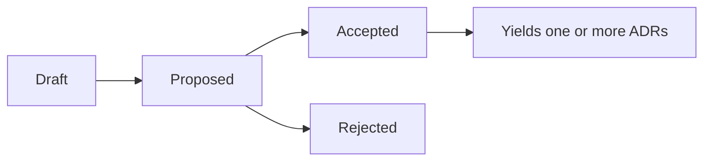

# Requests for Comments (RFCs)

RFCs are how we propose and socialize **substantial** changes to Lightbridge Code Intelligence
before a decision is made. They give a structured space for motivation, design detail, drawbacks,
and alternatives — the deliberation that a terse [ADR](../adr/README.md) does not capture. The model
is the [Rust RFC process](https://github.com/rust-lang/rfcs).

## When to write an RFC

Write an RFC when a change is large or far-reaching enough that it benefits from review *before*
implementation. Examples:

- a new subsystem or a cross-cutting architectural change
- a change to a public contract (API, schema, MCP tool surface)
- a security-sensitive design
- anything where reasonable engineers would want to weigh alternatives first

Small, obvious, or easily reversible decisions can skip the RFC and go straight to an
[ADR](../adr/README.md).

## Lifecycle

- **Draft** — author is still writing; not yet ready for wide review.
- **Proposed** — open for review and discussion.
- **Accepted** — agreed; the author records the resulting decision(s) as one or more
  [ADRs](../adr/README.md) and links them here.
- **Rejected** — not adopted; kept for the historical record and to avoid relitigating.

## Relationship to ADRs

An RFC is the *proposal and discussion*; an ADR is the *recorded, immutable decision*. An accepted
RFC typically yields one or more ADRs. See [ADR-0012](../adr/0012-rfc-process-alongside-adrs.md).

## Authoring

Copy [the template](0000-rfc-template.md) to `NNNN-kebab-title.md`, numbered sequentially.

## Index

| # | Title | Status |
|---|---|---|
| [0000](0000-rfc-template.md) | RFC template | — |
| [0001](0001-horizontally-scalable-control-plane.md) | Horizontally scalable control plane (stateless roles + Postgres-backed queue) | Proposed |
| [0002](0002-incremental-layered-indexing.md) | Incremental, layered indexing (base branch + per-PR overlays) | Proposed |
| [0003](0003-skip-auto-review-on-bot-authored-prs.md) | Skip the automatic review on bot-authored PRs | Accepted |
| [0004](0004-durable-repo-memory-via-external-mcp.md) | Durable repo memory via an external, consolidating MCP memory service | Proposed |
| [0005](0005-durable-orchestration-on-restate.md) | Durable task orchestration on Restate (strangler adoption; amends RFC-0001's later phases) | Proposed |
| [0006](0006-a2a-agent-surface.md) | A2A-compliant agent surface (expose Lightbridge agents over the Agent2Agent protocol, on the RFC-0005 substrate) | Proposed |
| [0007](0007-control-plane-v2-planes.md) | Control-plane v2 — **two binaries, three planes**: `control-plane` (ingress `serve`/`a2a`/`mcp` → orchestration `dispatcher`/`replay` → egress `reconciler`/`notifier`, holds DB+forge creds, no checkout) + a new **`agent-plane`** (`{index, review, open} × {run-once, serve}`, holds the checkout, no DB/forge) with topology as a deployment knob; ends the six-role sprawl and the 4Gi ghost; enabling changes — in-house code-graph crate retires Graphify ([ADR-0086](../adr/0086-in-house-code-graph-crate.md)) and `CheckpointRuntime` gives the loop replay without Restate ([ADR-0087](../adr/0087-durable-replay-checkpoint-runtime.md)); Restate kept for egress/lifecycle, not the loop; resulting ADRs [0085](../adr/0085-agent-execution-plane.md)/[0086](../adr/0086-in-house-code-graph-crate.md)/[0087](../adr/0087-durable-replay-checkpoint-runtime.md)/[0088](../adr/0088-open-mode-autonomous-ticket-agent.md) | Proposed |
